# 마도물어 시리즈 한글 번역 프로젝트

컴파일사의 RPG 마도물어(魔導物語) 시리즈의 한글 번역 패치를 배포하는 프로젝트입니다.

Claude Code 및 Codex를 활용하여 리버싱/번역하고, 사람이 기초 검수를 진행한 프로젝트입니다.

더 많은 게임의 번역에 대한 기여를 위해, 모든 패치에 사용된 코드는 기기별로 공개됩니다.

> 자매 프로젝트 - [뿌요뿌요 시리즈 한글 번역 프로젝트](https://github.com/mcpads/puyo-puyo-kr-patch)

## 패치 목록

| 스크린샷 | 게임 | 기종 | 버전 | 상태 | 최근 배포 |
| --- | --- | --- | --- | --- | --- |
| <a href="md-madou1/">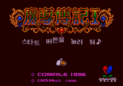</a> | [마도물어 I](md-madou1/) | 메가드라이브 | v2.0.0 | 정식 | 2026-08-02 |
|  | [마도물어 하나마루 대유치원아](sfc-hanamaru/) | 슈퍼 패미컴 | v1.4.0 | 정식 | 2026-08-01 |
| <a href="ss-madou/">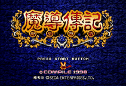</a> | [마도물어](ss-madou/) | 세가 새턴 | v1.2.0 | 정식 | 2026-08-01 |
| <a href="ss-waku-puyo/">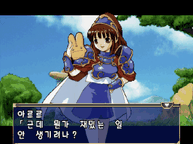</a> | [와쿠와쿠 뿌요뿌요 던전](ss-waku-puyo/) | 세가 새턴 | v0.2.0 | ⚠️ 베타 | 2026-08-09 |
| <a href="gg-madou1/">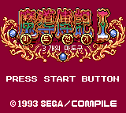</a> | [마도물어 I](gg-madou1/) | 게임기어 | v1.1.0 | 정식 | 2026-08-01 |
| <a href="gg-madou2/">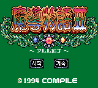</a> | [마도물어 II](gg-madou2/) | 게임기어 | v1.0.0 | 정식 | 2026-09-06 |
| <a href="gg-madou3/">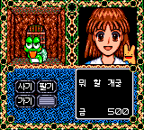</a> | [마도물어 III](gg-madou3/) | 게임기어 | v1.0.0 | 정식 | 2026-09-06 |
| <a href="gg-madou-a/">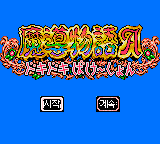</a> | [마도물어 A](gg-madou-a/) | 게임기어 | v1.0.0 | 정식 | 2026-09-06 |
| <a href="pce-madou1/">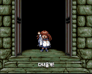</a> | [마도물어 I](pce-madou1/) | PC 엔진 CD | v1.0.1 | 정식 | 2026-08-09 |
| <a href="gbc-arle-no-bouken/">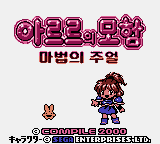</a> | [아르르의 모험 마법의 주얼](gbc-arle-no-bouken/) | 게임보이 컬러 | v0.1.0 | ⚠️ 베타 | 2026-08-23 |
|  | [마도물어 1-2-3](pc98-madou-123/) | PC-98 | v0.1.0 | ⚠️ 베타 | 2026-08-29 |
| <a href="pc98-madou-docho/">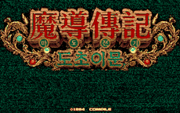</a> | [마도물어 도초이문](pc98-madou-docho/) | PC-98 | v1.0.0 | 정식 | 2026-08-28 |
| <a href="pc98-daimadou-senryaku-95/">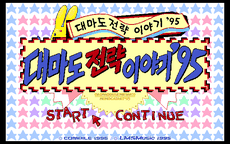</a> | [대마도전략물어'95](pc98-daimadou-senryaku-95/) | PC-98 | v1.0.0 | 정식 | 2026-09-06 |
| <a href="pc98-kikimora/">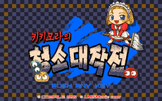</a> | [키키모라의 청소 대작전](pc98-kikimora/) | PC-98 | v0.1.0 | ⚠️ 베타 | 2026-08-28 |
| <a href="pc98-madou-ars/">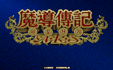</a> | [마도물어 A.R.S](pc98-madou-ars/) | PC-98 | v0.1.1 | ⚠️ 베타 | 2026-08-30 |
| <a href="pc98-madou-456/">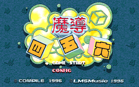</a> | [마도 사오륙](pc98-madou-456/) | PC-98 | v0.1.0 | ⚠️ 베타 | 2026-08-31 |
| <a href="pc98-bayoen-wars/">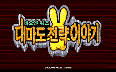</a> | [바요엔워즈 대마도전략물어](pc98-bayoen-wars/) | PC-98 | v0.1.0 | ⚠️ 베타 | 2026-09-01 |

각 행의 스크린샷이나 게임 이름을 누르면 적용 방법과 체크섬이 있는 상세 안내로 이동합니다.

- [번역 예정 작품](#번역-예정-작품)
- [이슈 제보 및 피드백](#이슈-제보-및-피드백)
- [업데이트 기록](CHANGELOG.md)
- [라이선스](#라이선스)

## 번역 예정 작품

### 와쿠와쿠 뿌요뿌요 던전 - 완전판 (PS1)

진행 중입니다.

- [x] 일본어 폰트 추출 및 테이블 완성
- [x] 시나리오 텍스트 추출
- [x] 시나리오 및 이벤트 대사 번역
- [x] 한글 폰트 통합 및 적용
- [x] 시스템 UI
- [x] 시스템 안정성
- [ ] 플레이 테스트 및 최종 검수

## 이슈 제보 및 피드백

어색한 번역, 번역 오타, 심각한 그래픽 깨짐, 게임 멈춤 등의 문제는 아래 방법으로 제보해 주세요.

- **GitHub Issue**: [이슈 트래커 링크](https://github.com/mcpads/madou-monogatari-kr-patch/issues)에 새 이슈를 등록해 주세요.
- **제보 시 포함할 내용**:
  - 문제가 발생한 위치 (예: 층 3층 상점 안)
  - 문제 현상 (예: 특정 아이템 사용 시 멈춤)
  - (가능하다면) 스크린샷이나 세이브 파일

## 라이선스

- 본 패치 파일은 개인적, 비상업적 용도로 제공됩니다. 원작 게임의 저작권은 해당 권리자에게 있습니다.
- 본 한글패치 파일 자체를 제작자에 허가없이 타 사이트에 재배포하지 말아 주시고, 재배포를 원하실 경우 패치원본 게시물의 링크를 공유해 주시기 바랍니다.
- 본 한글패치 파일을 이용하여 금전적 이득을 취하는 모든 행위를 일절 금합니다. 해당 행위로 발생하는 모든 책임은 이용 당사자에게 있으며, 패치 제작자는 어떠한 책임도 지지 않습니다.
