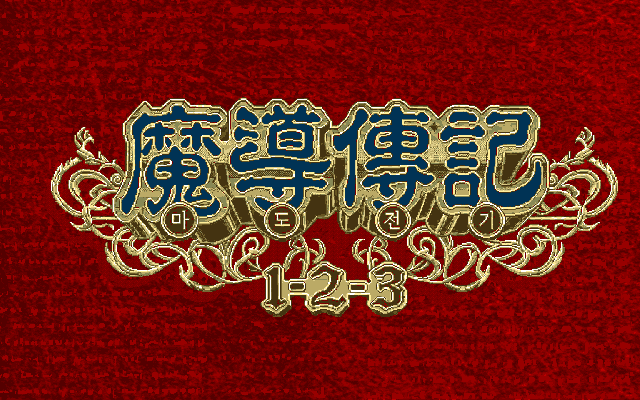

# 마도물어 시리즈 한글 번역 프로젝트

컴파일사의 RPG 마도물어(魔導物語) 시리즈의 한글 번역 패치를 배포하는 프로젝트입니다.

Claude Code 및 Codex를 활용하여 리버싱/번역하고, 사람이 기초 검수를 진행한 프로젝트입니다.

더 많은 게임의 번역에 대한 기여를 위해, 모든 패치에 사용된 코드는 기기별로 공개됩니다.

> 자매 프로젝트 - [뿌요뿌요 시리즈 한글 번역 프로젝트](https://github.com/mcpads/puyo-puyo-kr-patch)

## 목차

- [마도물어 I — 메가드라이브](#마도물어-i--메가드라이브)
- [마도물어 하나마루 대유치원아 (SNES)](#마도물어-하나마루-대유치원아-snes)
- [마도물어 (세가 새턴)](#마도물어-세가-새턴)
- [와쿠와쿠 뿌요뿌요 던전 (세가 새턴)](#와쿠와쿠-뿌요뿌요-던전-세가-새턴)
- [마도물어 I — 게임기어](#마도물어-i--게임기어)
- [마도물어 II — 게임기어 (베타)](#마도물어-ii--게임기어-베타)
- [마도물어 III — 게임기어 (베타)](#마도물어-iii--게임기어-베타)
- [마도물어 A — 게임기어 (베타)](#마도물어-a--게임기어-베타)
- [마도물어 I — PC 엔진 CD](#마도물어-i--pc-엔진-cd)
- [마도물어 1-2-3 — PC-98 (베타)](#마도물어-1-2-3--pc-98-베타)
- [번역 예정 작품](#번역-예정-작품)
- [이슈 제보 및 피드백](#이슈-제보-및-피드백)
- [업데이트 기록](#업데이트-기록)
- [라이선스](#라이선스)

## 마도물어 I — 메가드라이브

세가 메가드라이브(Genesis) **마도물어 I (魔導物語 I)** 한글 번역 패치입니다.

일본판 원본에 직접 적용하는 `v2.0.0` 패치입니다.

참고: [마도물어 I - 나무위키](https://namu.wiki/w/%EB%A7%88%EB%8F%84%EB%AC%BC%EC%96%B4#s-3)

### 적용 방법

1. **일본판 원본 ROM**을 준비합니다 (아래 체크섬으로 올바른 파일인지 확인)
2. [Madou Monogatari I (Mega Drive) KR v2.0.0.bps](https://raw.githubusercontent.com/mcpads/madou-monogatari-kr-patch/main/Madou%20Monogatari%20I%20(Mega%20Drive)%20KR%20v2.0.0.bps)를 다운로드합니다
3. [Floating IPS (Flips)](https://www.smwcentral.net/?p=section&a=details&id=11474) 등 BPS 패처로 일본판 원본 ROM에 한글 패치를 적용합니다

### 체크섬

#### 원본 ROM - Madou Monogatari I (Japan).md

| 알고리즘 | 해시                                                               |
| -------- | ------------------------------------------------------------------ |
| CRC32    | `DD82C401`                                                         |
| MD5      | `41B8BA3569E3F4F98155DEA64318D223`                                 |
| SHA-1    | `143456600E44F543796CF6ADE77830115A8F2F99`                         |
| SHA-256  | `61d1dec319afb1380dfbee0cdb42e6e64ab180941b0d533d8deed9efa502f83c` |
| 크기     | 2,097,152 bytes (2 MB)                                             |

#### KR 패치 파일 — Madou Monogatari I (Mega Drive) KR v2.0.0.bps

| 알고리즘 | 해시                                                               |
| -------- | ------------------------------------------------------------------ |
| CRC32    | `2144DF1C`                                                         |
| MD5      | `c2b5558834218b26a6b5a5e41a8b4b40`                                 |
| SHA-1    | `0f01cc8f9df5553a22d3fbc03adf90b206aeb9e0`                         |
| SHA-256  | `22317cdbdee27b49ba5b5d062194f164240048d57380635459db836808100883` |
| 크기     | 2,114,029 bytes (2.02 MB)                                          |

#### KR 패치 적용 후 — Madou Monogatari I (Mega Drive) KR v2.0.0.md

| 알고리즘 | 해시                                                               |
| -------- | ------------------------------------------------------------------ |
| CRC32    | `25B16835`                                                         |
| MD5      | `db44e12ed031f4632017c3c8a0e3c3e4`                                 |
| SHA-1    | `d0ae5a807e874e666d424ed749feb6c58df892bf`                         |
| SHA-256  | `863c787cad2ccbc2ba124bee32aec4d23e7c7046305bbf7e3eb1382a0ee25eef` |
| 크기     | 4,194,304 bytes (4 MB)                                             |

### 패치 정보

- 일본판 원본에 직접 적용하는 JP→KR 패치
- 한글 폰트: [Neo둥근모](https://neodgm.dalgona.dev/), [Galmuri](https://github.com/quiple/galmuri)
- [v1 패쳐 코드베이스](https://github.com/mcpads/md-madou-kr-patcher)

### 크레딧

- **패치 제작자**: mcpads
- **리버싱**: mcpads (with Claude Code, Codex)
- **QA**: mcpads
- **한글 번역**: Claude Code (Opus 4.6 및 Haiku 4.5), Codex (GPT 5.6-sol)
- **영어 번역 (베이스)**: [LIPEMCO! Translations](https://stargood.org/trans/lipemco.php)
- **원작**: Compile (1996)

## 마도물어 하나마루 대유치원아 (SNES)

슈퍼 패미컴 **마도물어 하나마루 대유치원아** 한글 번역 패치입니다.

참고: [마도물어 하나마루 대유치원아](https://namu.wiki/w/%EB%A7%88%EB%8F%84%EB%AC%BC%EC%96%B4%20%ED%95%98%EB%82%98%EB%A7%88%EB%A3%A8%20%EB%8C%80%EC%9C%A0%EC%B9%98%EC%9B%90%EC%95%84)

### 적용 방법

1. **일본판 원본 ROM**을 준비합니다 (아래 체크섬으로 올바른 파일인지 확인)
2. [Madou Monogatari - Hanamaru Daiyouchienji (KR v1.4.0).bps](https://raw.githubusercontent.com/mcpads/madou-monogatari-kr-patch/main/Madou%20Monogatari%20-%20Hanamaru%20Daiyouchienji%20(KR%20v1.4.0).bps)를 다운로드합니다
3. [Floating IPS (Flips)](https://www.smwcentral.net/?p=section&a=details&id=11474) 등 BPS 패처로 원본 ROM에 한글 패치를 적용합니다

### 체크섬

#### 원본 ROM — Madou Monogatari - Hanamaru Daiyouchienji (Japan).sfc

| 알고리즘 | 해시                                                             |
| -------- | ---------------------------------------------------------------- |
| CRC32    | 1354E81E                                                         |
| MD5      | 11b40949b167ee0ed6d7abb9ea32a81f                                 |
| SHA-1    | 164d51ce6cf2228a399ba11fc1f5803cace53cb7                         |
| SHA-256  | 72e7ff7857f577809b585f67f9c6b2211e6648c4f86519fc6c66e3f4bfd49f59 |
| 크기     | 2,097,152 bytes (2 MB)                                           |

#### KR 패치 파일 — Madou Monogatari - Hanamaru Daiyouchienji (KR v1.4.0).bps

| 알고리즘 | 해시                                                             |
| -------- | ---------------------------------------------------------------- |
| CRC32    | 2144DF1C                                                         |
| MD5      | 0dbdcbd7b54d74a0f39cc6080bf196a5                                 |
| SHA-1    | aeea4c1c17a5e38215640af66a847e7fca30c5ce                         |
| SHA-256  | 6fe2702d8d8b360aa68b3de1b1e9aec715142325188570f87669c113068350f0 |
| 크기     | 209,229 bytes (204 KB)                                           |

#### KR 패치 적용 후 — Madou Monogatari - Hanamaru Daiyouchienji (KR v1.4.0).sfc

| 알고리즘 | 해시                                                             |
| -------- | ---------------------------------------------------------------- |
| CRC32    | AF9747BD                                                         |
| MD5      | 2221584305d8bc960d6c4b79ac45be00                                 |
| SHA-1    | e736c5b43de02d580e091c43a16e95ee7127cc35                         |
| SHA-256  | 8364d39738e293274c4fa5ebeecf987e8337c65539ac18a342220e0b2879d192 |
| 크기     | 2,097,152 bytes (2 MB)                                           |

### 패치 정보

- 한글 폰트: [Galmuri](https://github.com/quiple/galmuri) 12px 및 [Dalmoori](https://github.com/RanolP/dalmoori-font) 8px 비트맵
- [패쳐 코드베이스](https://github.com/mcpads/sfc-madou-kr-patcher)

### 크레딧

- **패치 제작자**: mcpads
- **리버싱**: mcpads (with Claude Code)
- **한글 번역**: Claude Code (Opus 4.6 및 Haiku 4.5), Codex (GPT 5.3 codex)
- **QA**: mcpads
- **원작**: Compile (1996)

## 마도물어 (세가 새턴)

마도물어 **세가 새턴판** 한글 번역 패치입니다.

참고: [마도물어(세가 새턴) - 나무위키](https://namu.wiki/w/%EB%A7%88%EB%8F%84%EB%AC%BC%EC%96%B4(%EC%84%B8%EA%B0%80%20%EC%83%88%ED%84%B4))

### 적용 방법 (J)

1. **원본 ROM**을 준비합니다 (BIN/CUE 형식, 아래 체크섬으로 올바른 파일인지 확인)
2. [Madou Monogatari (Sega Saturn) KR v1.2.0.bps](https://raw.githubusercontent.com/mcpads/madou-monogatari-kr-patch/main/Madou%20Monogatari%20(Sega%20Saturn)%20KR%20v1.2.0.bps)를 다운로드합니다
3. [Floating IPS (Flips)](https://www.smwcentral.net/?p=section&a=details&id=11474) 등 BPS 패처로 원본 BIN 파일에 한글 패치를 적용합니다

### 적용 방법 (U)

1. **원본 ROM**을 준비합니다 (BIN/CUE 형식, 아래 체크섬으로 올바른 파일인지 확인)
2. [Madou Monogatari (U) (Sega Saturn) KR v1.2.0.bps](https://raw.githubusercontent.com/mcpads/madou-monogatari-kr-patch/main/Madou%20Monogatari%20(U)%20(Sega%20Saturn)%20KR%20v1.2.0.bps)를 다운로드합니다
3. [Floating IPS (Flips)](https://www.smwcentral.net/?p=section&a=details&id=11474) 등 BPS 패처로 원본 BIN 파일에 한글 패치를 적용합니다

### 체크섬 (J)

#### 원본 ROM — Madou Monogatari (J).bin (T-6607G V1.003)

| 알고리즘 | 해시                                         |
| -------- | -------------------------------------------- |
| CRC32    | `BBC3E5FA`                                   |
| MD5      | `fbc3ec7db5ca799ad30c5c772ff2b682`           |
| SHA-1    | `a3a4a727c91aa7c2eec8795457459bf6f1297721`   |
| 크기     | 146,661,312 bytes (140 MB, BIN/CUE Track 01) |

#### KR 패치 파일 — Madou Monogatari (Sega Saturn) KR v1.2.0.bps

| 알고리즘 | 해시                                                               |
| -------- | ------------------------------------------------------------------ |
| CRC32    | `2144DF1C`                                                         |
| MD5      | `3335ea848ab4eac98f5a49cdf748bd46`                                 |
| SHA-1    | `615d4e6f4b3f125c05cf1852544b630cd311749d`                         |
| SHA-256  | `51c746166f33a4353ade60e6149800cedb76f59948f7583bb05fb4ccb4c9b0b1` |
| 크기     | 4,495,930 bytes (4.3 MB)                                           |

#### KR 패치 적용 후 — Madou Monogatari (Sega Saturn) KR v1.2.0.bin

| 알고리즘 | 해시                                                               |
| -------- | ------------------------------------------------------------------ |
| CRC32    | `EAE5DB4F`                                                         |
| MD5      | `9342d4379a82e45346d69e311bd6878d`                                 |
| SHA-1    | `554e89c49a62ea993ddcbe6ea3e9b970fbaeaaa5`                         |
| SHA-256  | `2de4df18fdabfff2de50adbea739cc584d7f5e4b7a9a4f9179fd42f50ef22cad` |
| 크기     | 146,661,312 bytes (140 MB)                                         |

### 체크섬 (U)

#### 원본 ROM — Madou Monogatari (U).bin (T-6607G V1.003)

| 알고리즘 | 해시                                         |
| -------- | -------------------------------------------- |
| CRC32    | `C616ED2D`                                   |
| MD5      | `de1e8fb1b4d0901efd2aee5b09d0fcf9`           |
| SHA-1    | `e60b8ff5d9acc3366a36b1101013f529f722942d`   |
| 크기     | 146,308,512 bytes (139 MB, BIN/CUE Track 01) |

#### KR 패치 파일 — Madou Monogatari (U) (Sega Saturn) KR v1.2.0.bps

| 알고리즘 | 해시                                                               |
| -------- | ------------------------------------------------------------------ |
| CRC32    | `2144DF1C`                                                         |
| MD5      | `b1672f3d7651335f5e099823a143362d`                                 |
| SHA-1    | `26b9ee99d2672a1d25623cb430a853760626fad2`                         |
| SHA-256  | `6cee8d3d6081418f7a1f15de4ea6f5286f61a21372dad601ba85a3925be1daa9` |
| 크기     | 4,496,082 bytes (4.3 MB)                                           |

#### KR 패치 적용 후 — Madou Monogatari (U) (Sega Saturn) KR v1.2.0.bin

| 알고리즘 | 해시                                                               |
| -------- | ------------------------------------------------------------------ |
| CRC32    | `0D089EE2`                                                         |
| MD5      | `192211c8231eb23ec859da0c4ae90119`                                 |
| SHA-1    | `a891c420f021ae8e6160215480e58e9eaecc1087`                         |
| SHA-256  | `0554b416cba5c2af087f63c9901709e147aeb6a8ad62d3322306d0c69d181510` |
| 크기     | 146,308,512 bytes (139 MB)                                         |

### 패치 정보

- 시나리오/이벤트 대사 번역, 시스템 UI 및 타이틀 한글화
- 한글 폰트: [Galmuri](https://github.com/quiple/galmuri) (대화, 메뉴 탭), [MaplestoryBold](https://maplestory.nexon.com/Media/Font) (프롤로그, 레벨업), [Dalmoori](https://github.com/RanolP/dalmoori-font) (전투 UI)
- [패쳐 코드베이스](https://github.com/mcpads/ss-madou-kr-patcher)

### 크레딧

- **패치 제작자**: mcpads
- **리버싱**: mcpads (with Claude Code)
- **한글 번역**: Claude Code (Opus 4.6 및 Haiku 4.5), Codex (GPT 5.3 codex)
- **QA**: mcpads
- **원작**: Compile (1998)

## 와쿠와쿠 뿌요뿌요 던전 (세가 새턴)

**와쿠와쿠 뿌요뿌요 던전 (わくわくぷよぷよダンジョン) 세가 새턴 판** 한글 번역 PoC 패치입니다.

> **이 패치는 선공개용 베타 버전으로 아직 번역 등의 검수가 끝나지 않은 상태입니다. 미번역 요소, 게임 진행에 차질이 생기는 버그가 존재할 수 있으며, 번역 및 그래픽 요소가 대량으로 변경될 수 있습니다.** 9월 중 강화된 패치 방식으로 배포 예정입니다.

참고: [와쿠와쿠 뿌요뿌요 던전 - 나무위키](https://namu.wiki/w/%EC%99%80%EC%BF%A0%EC%99%80%EC%BF%A0%20%EB%BF%8C%EC%9A%94%EB%BF%8C%EC%9A%94%20%EB%8D%98%EC%A0%84)

### 적용 방법

1. **원본 ROM**을 준비합니다 (BIN/CUE 형식, 아래 체크섬으로 올바른 파일인지 확인)
2. [Waku Waku Puyo Puyo Dungeon (Sega Saturn) KR v0.2.0.bps](https://raw.githubusercontent.com/mcpads/madou-monogatari-kr-patch/main/Waku%20Waku%20Puyo%20Puyo%20Dungeon%20(Sega%20Saturn)%20KR%20v0.2.0.bps)를 다운로드합니다
3. [Floating IPS (Flips)](https://www.smwcentral.net/?p=section&a=details&id=11474) 등 BPS 패처로 원본 BIN 파일(Track 1)에 한글 패치를 적용합니다

### 체크섬

#### 원본 ROM — Waku Waku Puyo Puyo Dungeon (Japan) (4M) (Track 1).bin (T-6608G V1.001)

| 알고리즘 | 해시                                                               |
| -------- | ------------------------------------------------------------------ |
| CRC32    | `B8D1E870`                                                         |
| MD5      | `567e6dfc4776c7cf3e417d5c98f34dbf`                                 |
| SHA-1    | `e0af339ab1985b33560937fa69f01a1d19c61242`                         |
| SHA-256  | `3edd5058cce6c6d36b69813a8d207d15fece8b79f3b5638522325fe3fa839f69` |
| 크기     | 89,848,752 bytes (85 MB, BIN/CUE Track 01)                         |

#### KR 패치 파일 — Waku Waku Puyo Puyo Dungeon (Sega Saturn) KR v0.2.0.bps

| 알고리즘 | 해시                                                               |
| -------- | ------------------------------------------------------------------ |
| CRC32    | `2144DF1C`                                                         |
| MD5      | `f0df0398072c37c5abf0744ca9133dda`                                 |
| SHA-1    | `a481db2d5e1cf9406fb9123e35329bfad2c5459f`                         |
| SHA-256  | `34a28b68494e33c1f9aa394dc5a21b126687bd5dbc5904231e1d8b10a8c75c45` |
| 크기     | 905,161 bytes (884 KB)                                             |

#### KR 패치 적용 후 — Waku Waku Puyo Puyo Dungeon (Sega Saturn) KR v0.2.0.bin

| 알고리즘 | 해시                                                               |
| -------- | ------------------------------------------------------------------ |
| CRC32    | `AF81C4D7`                                                         |
| MD5      | `8246583f53a995ddb01120543950cecf`                                 |
| SHA-1    | `70aa21beea0fd12c1228d89d17a9384d53c0c816`                         |
| SHA-256  | `673410710da9c2889969cc4085ab2e124fcab76530d95d73f1416b3169317c3f` |
| 크기     | 89,848,752 bytes (85 MB)                                           |

### 패치 정보

- 시나리오/이벤트 대사 초벌 번역, 시스템 UI 한글화
- 한글 폰트: [MaplestoryLight](https://maplestory.nexon.com/Media/Font), [MaplestoryBold](https://maplestory.nexon.com/Media/Font), [Galmuri](https://github.com/quiple/galmuri), [Dalmoori](https://github.com/RanolP/dalmoori-font)
- [패쳐 코드베이스](https://github.com/mcpads/ss-waku-puyo-kr-patcher)

### 크레딧

- **패치 제작자**: mcpads
- **리버싱**: mcpads (with Claude Code)
- **한글 번역**: Claude Code (Opus 4.6 및 Sonnet 4.6), Codex (GPT 5.4)
- **QA**: mcpads
- **원작**: Compile (1998)

## 마도물어 I — 게임기어

세가 게임기어 **마도물어 I (魔導物語 I - 3つの魔導球)** 한글 번역 패치입니다.

> **정식 배포 (v1.1.0)**

참고: [마도물어 I - 나무위키](https://namu.wiki/w/%EB%A7%88%EB%8F%84%EB%AC%BC%EC%96%B4#s-3)

### 적용 방법

1. **일본판 원본 ROM**을 준비합니다 (아래 체크섬으로 올바른 파일인지 확인)
2. [Madou Monogatari I (Game Gear) KR v1.1.0.bps](https://raw.githubusercontent.com/mcpads/madou-monogatari-kr-patch/main/Madou%20Monogatari%20I%20(Game%20Gear)%20KR%20v1.1.0.bps)를 다운로드합니다
3. [Floating IPS (Flips)](https://github.com/Alcaro/Flips) 등 BPS 패처로 **일본판 원본 ROM**에 한글 패치를 직접 적용합니다

### 체크섬

#### 원본 ROM — Madou Monogatari I - 3-Tsu no Madoukyuu (Japan).gg

| 알고리즘 | 해시                                                               |
| -------- | ------------------------------------------------------------------ |
| CRC32    | `00C34D94`                                                         |
| MD5      | `abca338c5f08d06526d09b70588add2c`                                 |
| SHA-1    | `5ccd474cefcb8e086e2e1f77c0fdd5c1d2bf82e7`                         |
| SHA-256  | `4a87f02f358688bc7680d0d34f527e10a087fec95dbf7ed131241d8ffe4c0654` |
| 크기     | 524,288 bytes (512 KB)                                             |

#### KR 패치 파일 — Madou Monogatari I (Game Gear) KR v1.1.0.bps

| 알고리즘 | 해시                                                               |
| -------- | ------------------------------------------------------------------ |
| CRC32    | `2144DF1C`                                                         |
| MD5      | `359362ed7f530a0662500be472d3e1f3`                                 |
| SHA-1    | `2ea4917b5d30340b30d14efdfd8c88ea3a90ce5c`                         |
| SHA-256  | `a5a6367af0878b9393513e59c19e2d4da121b3ae08449d2e699329dd3b852310` |
| 크기     | 526,574 bytes (514 KB)                                             |

#### KR 패치 적용 후 — Madou Monogatari I (Game Gear) KR v1.1.0.gg

| 알고리즘 | 해시                                                               |
| -------- | ------------------------------------------------------------------ |
| CRC32    | `13E69B40`                                                         |
| MD5      | `018249ad9bf853fff80d9b8188d190c3`                                 |
| SHA-1    | `9c9a6884b4a949c8c7be9870edcc05e398ed2da1`                         |
| SHA-256  | `04d04eabcfa912d4350e00dafaabc2d7ba9f9edf224903df211218d66ed8f62e` |
| 크기     | 1,048,576 bytes (1 MB)                                             |

### 진행 상황

- [x] 일본어 폰트 추출 및 테이블 완성
- [x] 시나리오 텍스트 추출
- [x] 시나리오 및 이벤트 대사 번역
- [x] 한글 폰트 통합 및 적용
- [x] 시스템 UI
- [x] 시스템 안정성
- [x] 플레이 테스트 및 최종 인게임 검수

### 패치 정보

- 시나리오/이벤트 대사 및 시스템 UI 한글화
- 한글 폰트: [Dalmoori](https://github.com/RanolP/dalmoori-font) 8px 비트맵
- [패쳐 코드베이스](https://github.com/mcpads/gg-madou1-kr-patcher)

### 크레딧

- **패치 제작자**: mcpads
- **리버싱**: mcpads (with Claude Code)
- **한글 번역**: Claude Code (Opus 4.8)
- **QA**: mcpads
- **역공학 참고**: 게임기어 영문 번역 패치 (English v1.0, Hardware Fix)
- **원작**: Compile (1993)

## 마도물어 II — 게임기어 (베타)

세가 게임기어 **마도물어 II - 아르르 16세 (魔導物語 II - アルル16才)** 한글 번역 패치입니다.

> ⚠️ **베타 배포 (v0.4.0)**: 게임 전반은 정상 플레이 가능하나 최종 인게임 검수가 진행 중입니다. 어색한 번역·표기·그래픽 문제는 제보해 주세요.

참고: [마도물어 - 나무위키](https://namu.wiki/w/%EB%A7%88%EB%8F%84%EB%AC%BC%EC%96%B4)

### 적용 방법

1. **일본판 원본 ROM**을 준비합니다 (아래 체크섬으로 올바른 파일인지 확인)
2. [Madou Monogatari II (Game Gear) KR v0.4.0.bps](https://raw.githubusercontent.com/mcpads/madou-monogatari-kr-patch/main/Madou%20Monogatari%20II%20(Game%20Gear)%20KR%20v0.4.0.bps)를 다운로드합니다
3. [Floating IPS (Flips)](https://github.com/Alcaro/Flips) 등 BPS 패처로 **일본판 원본 ROM**에 한글 패치를 직접 적용합니다

### 체크섬

#### 원본 ROM — Madou Monogatari II - Arle 16-Sai (Japan).gg

| 알고리즘 | 해시                                                               |
| -------- | ------------------------------------------------------------------ |
| CRC32    | `12EB2287`                                                         |
| MD5      | `81a57f26b7a1ccaa21bf7678b3596cb2`                                 |
| SHA-1    | `deead79fa4cb2e87652a9c8a76f2a7174f48f37a`                         |
| SHA-256  | `9da7d65d1772ae9b5fa71cee68b19f78bfc4848451ad6bbb5662498b2dbb997a` |
| 크기     | 524,288 bytes (512 KB)                                             |

#### KR 패치 파일 — Madou Monogatari II (Game Gear) KR v0.4.0.bps

| 알고리즘 | 해시                                                               |
| -------- | ------------------------------------------------------------------ |
| CRC32    | `2144DF1C`                                                         |
| MD5      | `ffb0fbb42165b73a964e33c269a83f1b`                                 |
| SHA-1    | `033e9a8d3937749df5c083a5576c0f8787bbe4d4`                         |
| SHA-256  | `e9b15b4ae79226a50f940dff0a1b5c7d2e00e942973735b627da2beeaa0c8630` |
| 크기     | 526,591 bytes (514 KB)                                             |

#### KR 패치 적용 후 — Madou Monogatari II (Game Gear) KR v0.4.0.gg

| 알고리즘 | 해시                                                               |
| -------- | ------------------------------------------------------------------ |
| CRC32    | `B18BD6CE`                                                         |
| MD5      | `5709dfcf8d227dbc52c698176c7c772b`                                 |
| SHA-1    | `54decb713bbe1389308210be85985578fe0fbbdb`                         |
| SHA-256  | `b3a5c8f27611d098bab3375c28c2225890317411f29dcd494e4828c0695e718f` |
| 크기     | 1,048,576 bytes (1 MB)                                             |

### 진행 상황

- [x] 일본어 폰트 추출 및 테이블 완성
- [x] 시나리오 텍스트 추출 및 확장 뱅크 재배치
- [x] 시나리오 및 이벤트 대사 번역
- [x] 한글 폰트 통합 및 렌더러 훅
- [x] 시스템 UI
- [x] 시스템 안정성
- [ ] 플레이 테스트 및 최종 인게임 검수 (진행 중)

### 패치 정보

- 시나리오/이벤트 대사 번역, 시스템 UI 한글화
- 한글 폰트: [Dalmoori](https://github.com/RanolP/dalmoori-font) 8px 비트맵
- [패쳐 코드베이스](https://github.com/mcpads/gg-madou2-kr-patcher)

### 크레딧

- **패치 제작자**: mcpads
- **리버싱**: mcpads (with Claude Code)
- **한글 번역**: Claude Code (Opus 4.8)
- **QA**: mcpads
- **원작**: Compile (1994)

## 마도물어 III — 게임기어 (베타)

세가 게임기어 **마도물어 III - 궁극의 여왕님 (魔導物語 III - 究極の女王様)** 한글 번역 패치입니다.

> ⚠️ **베타 배포 (v0.1.0)**: 게임 전반은 정상 플레이 가능하나 최종 인게임 검수가 진행 중입니다. 어색한 번역·표기·그래픽 문제는 제보해 주세요.

참고: [마도물어 - 나무위키](https://namu.wiki/w/%EB%A7%88%EB%8F%84%EB%AC%BC%EC%96%B4)

### 적용 방법

1. **일본판 원본 ROM**을 준비합니다 (아래 체크섬으로 올바른 파일인지 확인)
2. [Madou Monogatari III (Game Gear) KR v0.1.0.bps](https://raw.githubusercontent.com/mcpads/madou-monogatari-kr-patch/main/Madou%20Monogatari%20III%20(Game%20Gear)%20KR%20v0.1.0.bps)를 다운로드합니다
3. [Floating IPS (Flips)](https://github.com/Alcaro/Flips) 등 BPS 패처로 **일본판 원본 ROM**에 한글 패치를 직접 적용합니다

### 체크섬

#### 원본 ROM — Madou Monogatari III - Kyuukyoku Joou-sama (Japan).gg

| 알고리즘 | 해시                                                               |
| -------- | ------------------------------------------------------------------ |
| CRC32    | `0A634D79`                                                         |
| MD5      | `b8b5305ec2f68d7bb3c9f622a13eba7c`                                 |
| SHA-1    | `dd590c9086161b1f97573c48720c32cc5506dabc`                         |
| SHA-256  | `a02710b5cbf71e49a3aaa18c1e28be769bb634139fd987101c448575467f8ca3` |
| 크기     | 524,288 bytes (512 KB)                                             |

#### KR 패치 파일 — Madou Monogatari III (Game Gear) KR v0.1.0.bps

| 알고리즘 | 해시                                                               |
| -------- | ------------------------------------------------------------------ |
| CRC32    | `2144DF1C`                                                         |
| MD5      | `463b00a65eefc0a52e6b69017703091a`                                 |
| SHA-1    | `b0d56d7917b22a294f42032ddb2029b3f80c8926`                         |
| SHA-256  | `62203cae2c958f35731d03337a2fe20833844437370b4a69b3fab47115edd981` |
| 크기     | 526,244 bytes (514 KB)                                             |

#### KR 패치 적용 후 — Madou Monogatari III (Game Gear) KR v0.1.0.gg

| 알고리즘 | 해시                                                               |
| -------- | ------------------------------------------------------------------ |
| CRC32    | `76AE7609`                                                         |
| MD5      | `c365ff7a14da95ad206101f640e63441`                                 |
| SHA-1    | `e28a58a9b09c90a3dd9de0ea4422566d110f701f`                         |
| SHA-256  | `8fe5571ca714904f3909a60e38466884e83f93e4bc5233475a27469d61f20a88` |
| 크기     | 1,048,576 bytes (1 MB)                                             |

### 진행 상황

- [x] 일본어 폰트 추출 및 테이블 완성
- [x] 시나리오 텍스트 추출 및 확장 뱅크 재배치
- [x] 시나리오 및 이벤트 대사 번역
- [x] 한글 폰트 통합 및 렌더러 훅
- [x] 시스템 UI
- [x] 시스템 안정성
- [ ] 플레이 테스트 및 최종 인게임 검수 (진행 중)

### 패치 정보

- 시나리오/이벤트 대사 번역, 시스템 UI 한글화
- 한글 폰트: [Dalmoori](https://github.com/RanolP/dalmoori-font) 8px 비트맵
- [패쳐 코드베이스](https://github.com/mcpads/gg-madou3-kr-patcher)

### 크레딧

- **패치 제작자**: mcpads
- **리버싱**: mcpads (with Claude Code)
- **한글 번역**: Claude Code (Opus 4.8)
- **QA**: mcpads
- **원작**: Compile (1994)

## 마도물어 A — 게임기어 (베타)

세가 게임기어 **마도물어 A (魔導物語A どきどきばけ〜しょん)** 한글 번역 패치입니다.

> ⚠️ **베타 배포 (v0.1.0)**: 전체 번역을 수록했으나 사람 최종 검수와 최종 인게임 검수가 진행 중입니다. 어색한 번역·표기·그래픽 문제나 진행 문제는 제보해 주세요.

참고: [마도물어 - 나무위키](https://namu.wiki/w/%EB%A7%88%EB%8F%84%EB%AC%BC%EC%96%B4)

### 적용 방법

1. **일본판 원본 ROM**을 준비합니다 (아래 체크섬으로 올바른 파일인지 확인)
2. [Madou Monogatari A (Game Gear) KR v0.1.0.bps](https://raw.githubusercontent.com/mcpads/madou-monogatari-kr-patch/main/Madou%20Monogatari%20A%20(Game%20Gear)%20KR%20v0.1.0.bps)를 다운로드합니다
3. [Floating IPS (Flips)](https://github.com/Alcaro/Flips) 등 BPS 패처로 **일본판 원본 ROM**에 한글 패치를 직접 적용합니다

### 체크섬

#### 원본 ROM — Madou Monogatari A - Dokidoki Vacation (Japan).gg

| 알고리즘 | 해시                                                               |
| -------- | ------------------------------------------------------------------ |
| CRC32    | `7EC95282`                                                         |
| MD5      | `ab0d1eb20ac63a984d874a885ca2588d`                                 |
| SHA-1    | `c027aa76fe0e09a2d1b982eea0df2c8b687aadf7`                         |
| SHA-256  | `6679b88d3db2ca62a78b1904cfe8364f7e6d5d74ffda27b7dbe49417ed2d02ec` |
| 크기     | 524,288 bytes (512 KB)                                             |

#### KR 패치 파일 — Madou Monogatari A (Game Gear) KR v0.1.0.bps

| 알고리즘 | 해시                                                               |
| -------- | ------------------------------------------------------------------ |
| CRC32    | `2144DF1C`                                                         |
| MD5      | `e7249d6db45b10c11b7acdfd5bf813d3`                                 |
| SHA-1    | `f94b9c08f7169a218b636e23e8d5d6b9cc115db5`                         |
| SHA-256  | `97b1ecfe99ea5f4e03daae0f68831b4f43449651c82086a571c1d7f26cc08d73` |
| 크기     | 529,922 bytes (518 KB)                                             |

#### KR 패치 적용 후 — Madou Monogatari A (Game Gear) KR v0.1.0.gg

| 알고리즘 | 해시                                                               |
| -------- | ------------------------------------------------------------------ |
| CRC32    | `A581A0DF`                                                         |
| MD5      | `6d2b2c79f69231d01f83f75c43966efa`                                 |
| SHA-1    | `fcac653b65b4c25684bb8254490d8c714176b801`                         |
| SHA-256  | `79203d5f751db6540d708041531a23b0da694f00d88b995adac3a1404fe68bb3` |
| 크기     | 1,048,576 bytes (1 MB)                                             |

### 패치 정보

- 일본판 원본에 직접 적용하는 JP→KR BPS
- 시나리오/이벤트 대사 번역, 시스템 UI 한글화
- 한글 폰트: [Dalmoori](https://github.com/RanolP/dalmoori-font) 8px 비트맵
- [패쳐 코드베이스](https://github.com/mcpads/gg-madoua-kr-patcher)

### 크레딧

- **패치 제작자**: mcpads
- **리버싱**: mcpads (with Claude Code, Codex)
- **한글 번역**: Claude Code (Opus 4.8), Codex (GPT-5.6 sol)
- **QA**: mcpads
- **역공학 참고**: [madouaggtools](https://github.com/suppertails66/madouaggtools) (Supper/Filler 영문 패치)
- **원작**: Compile (1996)

## 마도물어 I — PC 엔진 CD

PC 엔진 CD-ROM² **마도물어 I - 불꽃의 꼬마 졸업생 (魔導物語I 炎の卒園児)** 한글 번역 패치입니다.

일본판 원본에 직접 적용하는 `v1.0.1` 패치입니다.

### 적용 방법

1. 아래 체크섬과 일치하는 일본판 원본 32트랙 BIN/CUE를 준비합니다
2. [Madou Monogatari I - Honoo no Sotsuenji (PC Engine CD) KR v1.0.1.bps](https://raw.githubusercontent.com/mcpads/madou-monogatari-kr-patch/main/Madou%20Monogatari%20I%20-%20Honoo%20no%20Sotsuenji%20%28PC%20Engine%20CD%29%20KR%20v1.0.1.bps)를 다운로드합니다
3. [Floating IPS (Flips)](https://github.com/Alcaro/Flips) 등 BPS 패처로 패치를 **원본 `(Track 02).bin`에만** 적용합니다. CUE, 전체 디스크 합본, ISO/2048 파일에는 적용하지 않습니다
4. 패치 적용 후 파일을 원본 `(Track 02).bin`과 같은 이름으로 두면 기존 CUE를 그대로 사용할 수 있습니다. Track 01과 Track 03~32는 원본 그대로 유지합니다

### 체크섬

#### 원본 Track 02 — Madou Monogatari I - Honoo no Sotsuenji (Japan) (Track 02).bin

| 알고리즘 | 해시                                                               |
| -------- | ------------------------------------------------------------------ |
| CRC32    | `146E1E2B`                                                         |
| MD5      | `a0819940f217c31439b56393d2c15df5`                                 |
| SHA-1    | `754696b6527c12259280e82f9233d555f1157340`                         |
| SHA-256  | `6cd2603393679e8a236940853d52db45d689952d88bda3445da9aefe63b38564` |
| 크기     | 41,150,592 bytes                                                   |

#### KR 패치 파일 — Madou Monogatari I - Honoo no Sotsuenji (PC Engine CD) KR v1.0.1.bps

| 알고리즘 | 해시                                                               |
| -------- | ------------------------------------------------------------------ |
| CRC32    | `2144DF1C`                                                         |
| MD5      | `38a09626d509c691d50848e80710340f`                                 |
| SHA-1    | `de290fdd9dfc3c4c059262e5147189d47c091b4d`                         |
| SHA-256  | `190df561de8dd38840fe81d9047b78ea5150c398590c2572aa78031ddce8f16f` |
| 크기     | 316,926 bytes                                                      |

#### KR 패치 적용 후 Track 02 — Madou Monogatari I - Honoo no Sotsuenji (PC Engine CD) KR v1.0.1 (Track 02).bin

| 알고리즘 | 해시                                                               |
| -------- | ------------------------------------------------------------------ |
| CRC32    | `8FAFAFE1`                                                         |
| MD5      | `4c356850fecbbdf9383714d36cdcb7ad`                                 |
| SHA-1    | `f02e4f24cdca1f960f229e9782793c861717400f`                         |
| SHA-256  | `557393a1660dba6b8343a49863b213ecc19d954674dbb24d3846c5c92617bb72` |
| 크기     | 41,150,592 bytes                                                   |

### 패치 정보

- 일본판 원본 raw MODE1/2352 Track 02에 직접 적용하는 JP→KR BPS
- 시나리오·시스템 UI·컷신 자막·타이틀 한글화
- 일반 대사·메뉴 한글 폰트: [Neo둥근모](https://neodgm.dalgona.dev/) 16px 비트맵
- 컷신 자막 한글 폰트: Maplestory Bold
- [패쳐 코드베이스](https://github.com/mcpads/pce-madou1-kr-patcher)

### 크레딧

- **패치 제작자**: mcpads
- **원작**: Compile / NEC Avenue (1996)

## 마도물어 1-2-3 — PC-98 (베타)

PC-98 합본 재발매판용 한글 번역 베타 패치입니다. 여섯 장의 System·Sampling HDM에 각각 BPS를 적용하며, 후반부에는 원본 Data 디스크를 사용합니다.

지원 원본, 패치 적용 순서, 실행 방법과 베타 주의사항은 [PC-98 마도물어 1-2-3 한글 패치 안내](pc98-madou-123/)에서 확인해 주세요.

- [패쳐 코드베이스](https://github.com/mcpads/pc98-madou123-kr-patcher)

## 번역 예정 작품

### 와쿠와쿠 뿌요뿌요 던전 - 완전판 (PS1)

진행 중입니다.

- [x] 일본어 폰트 추출 및 테이블 완성
- [x] 시나리오 텍스트 추출
- [x] 시나리오 및 이벤트 대사 번역
- [x] 한글 폰트 통합 및 적용
- [x] 시스템 UI
- [x] 시스템 안정성
- [ ] 플레이 테스트 및 최종 검수

### 마도물어 A-R-S (PC-98)

- [x] 일본어 폰트 추출 및 테이블 완성
- [x] 시나리오 텍스트 추출
- [x] 시나리오 및 이벤트 대사 번역
- [x] 한글 폰트 통합 및 적용
- [x] 시스템 UI
- [x] 시스템 안정성
- [ ] 플레이 테스트 및 최종 검수

### 바요엔워즈 대마도전략물어 (PC-98)

- [ ] 일본어 폰트 추출 및 테이블 완성
- [ ] 시나리오 텍스트 추출
- [ ] 시나리오 및 이벤트 대사 번역
- [ ] 한글 폰트 통합 및 적용
- [ ] 시스템 UI
- [ ] 시스템 안정성
- [ ] 플레이 테스트 및 최종 검수

### 대마도전략물어'95 (PC-98)

- [x] 일본어 폰트 추출 및 테이블 완성
- [x] 시나리오 텍스트 추출
- [x] 시나리오 및 이벤트 대사 번역
- [x] 한글 폰트 통합 및 적용
- [x] 시스템 UI
- [x] 시스템 안정성
- [ ] 플레이 테스트 및 최종 검수

### 아르르의 모험 - 마법의 쥬얼 (GBC)

- [ ] 일본어 폰트 추출 및 테이블 완성
- [ ] 시나리오 텍스트 추출
- [ ] 시나리오 및 이벤트 대사 번역
- [ ] 한글 폰트 통합 및 적용
- [ ] 시스템 UI
- [ ] 시스템 안정성
- [ ] 플레이 테스트 및 최종 검수

## 이슈 제보 및 피드백

어색한 번역, 번역 오타, 심각한 그래픽 깨짐, 게임 멈춤 등의 문제는 아래 방법으로 제보해 주세요.

- **GitHub Issue**: [이슈 트래커 링크](https://github.com/mcpads/madou-monogatari-kr-patch/issues)에 새 이슈를 등록해 주세요.
- **제보 시 포함할 내용**:
  - 문제가 발생한 위치 (예: 층 3층 상점 안)
  - 문제 현상 (예: 특정 아이템 사용 시 멈춤)
  - 사용 중인 에뮬레이터 및 버전
  - (가능하다면) 스크린샷이나 세이브 파일

## 업데이트 기록

| 버전   | 날짜       | 대상                               | 내용                                                                |
| ------ | ---------- | ---------------------------------- | ------------------------------------------------------------------- |
| v1.0.0 | 2026-02-16 | 마도물어 I (MD)                    | 최초 배포                                                           |
| v0.1.0 | 2026-02-24 | 마도물어 하나마루 대유치원아       | 베타 버전 배포                                                      |
| v1.0.0 | 2026-02-26 | 마도물어 하나마루 대유치원아       | 최초 배포                                                           |
| v1.1.0 | 2026-03-01 | 마도물어 하나마루 대유치원아       | 버그 수정 (대사 잘림, 대사 오표시, 상점 매진, 선택지 하이라이트 등) |
| v1.1.0 | 2026-03-06 | 마도물어 I (MD)                    | 번역 다수 수정, 층 표시 수정, 텍스트 잘림 수정                      |
| v1.2.0 | 2026-03-07 | 마도물어 하나마루 대유치원아       | 몇몇 번역 관련 버그 패치                                            |
| v0.1.0 | 2026-03-07 | 마도물어 (세가 새턴)               | 베타 배포 (시스템 UI 미번역)                                        |
| v0.2.0 | 2026-03-08 | 마도물어 (세가 새턴)               | 베타 배포 (번역 교정, 추가 UI 한글화)                               |
| v0.3.0 | 2026-03-08 | 마도물어 (세가 새턴)               | 뿌요카드 버그 수정                                                  |
| v1.3.0 | 2026-03-09 | 마도물어 하나마루 대유치원아       | 몇몇 미번역 오류 수정                                               |
| v0.4.0 | 2026-03-11 | 마도물어 (세가 새턴)               | 시스템 UI 추가 번역                                                 |
| v1.0.0 | 2026-03-17 | 마도물어 (세가 새턴)               | 정식 배포                                                           |
| v0.1.0 | 2026-03-24 | 와쿠와쿠 뿌요뿌요 던전 (세가 새턴) | 베타 배포                                                           |
| v1.1.0 | 2026-07-05 | 마도물어 (세가 새턴)               | 선택지 진행 불가 및 텍스트 오버플로우 수정                          |
| v0.1.0 | 2026-07-08 | 마도물어 I (게임기어)              | 베타 배포                                                          |
| v0.1.0 | 2026-07-08 | 마도물어 II (게임기어)              | 베타 배포                                                          |
| v0.1.0 | 2026-07-08 | 마도물어 III (게임기어)              | 베타 배포                                                          |
| v0.2.0 | 2026-07-11 | 마도물어 I (게임기어)              | 일본판 원본 직접 적용 전환, UI 재구축, 명칭·프롤로그 표시 오류 수정    |
| v0.2.0 | 2026-07-11 | 마도물어 II (게임기어)              | 포트레이트 제어코드 복원, 대사 박스·줄바꿈 교정, 타이틀 메뉴·문장부호 개선 |
| v0.1.0 | 2026-07-11 | 마도물어 A (게임기어)              | 베타 배포                                                          |
| v0.1.0 | 2026-07-14 | 마도물어 I (PC 엔진 CD)             | 베타 배포                                                          |
| v0.2.0 | 2026-07-18 | 마도물어 I (PC 엔진 CD)             | 번역·말투·용어 및 인트로 자막 교정                                |
| v0.2.1 | 2026-07-18 | 마도물어 I (PC 엔진 CD)             | 라이트 사용 시 진행 불가 수정                                     |
| v0.3.0 | 2026-07-19 | 마도물어 I (게임기어)              | 번역 수정 및 방향 UI 번역                                         |
| v1.0.0 | 2026-07-20 | 마도물어 I (게임기어)              | 정식 배포                                                          |
| v0.3.0 | 2026-07-23 | 마도물어 II (게임기어)             | 번역·용어·문장부호 및 대사 레이아웃 교정                           |
| v0.4.0 | 2026-07-26 | 마도물어 II (게임기어)             | 버그 수정 및 번역 교정                                             |
| v2.0.0-rc.0 | 2026-08-01 | 마도물어 I (MD)                    | 릴리스 후보                                                         |
| v1.4.0 | 2026-08-01 | 마도물어 하나마루 대유치원아       | 타이틀 화면 한글화, 번역 전수 교정 및 대사 오버플로우 수정         |
| v1.2.0 | 2026-08-01 | 마도물어 (세가 새턴)               | 타이틀 한글화                                                       |
| v1.1.0 | 2026-08-01 | 마도물어 I (게임기어)              | 타이틀 화면 한글화                                                 |
| v2.0.0 | 2026-08-02 | 마도물어 I (MD)                    | 일본판 직접 적용 정식 배포                                         |
| v1.0.0 | 2026-08-05 | 마도물어 I (PC 엔진 CD)            | 정식 배포                                                           |
| v0.2.0 | 2026-08-09 | 와쿠와쿠 뿌요뿌요 던전 (세가 새턴) | 번역·UI 교정                                                       |
| v1.0.1 | 2026-08-09 | 마도물어 I (PC 엔진 CD)            | 타이틀 화면 수정                                                    |
| v0.1.0 | 2026-08-11 | 마도물어 1-2-3 (PC-98)             | 베타 배포                                                           |

## 라이선스

- 본 패치 파일은 개인적, 비상업적 용도로 제공됩니다. 원작 게임의 저작권은 해당 권리자에게 있습니다.
- 본 한글패치 파일 자체를 제작자에 허가없이 타 사이트에 재배포하지 말아 주시고, 재배포를 원하실 경우 패치원본 게시물의 링크를 공유해 주시기 바랍니다.
- 본 한글패치 파일을 이용하여 금전적 이득을 취하는 모든 행위를 일절 금합니다. 해당 행위로 발생하는 모든 책임은 이용 당사자에게 있으며, 패치 제작자는 어떠한 책임도 지지 않습니다.
