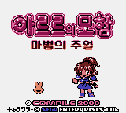
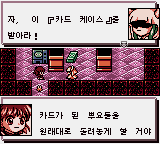
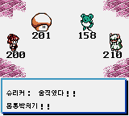

# 아르르의 모험 마법의 주얼 — 게임보이 컬러 (베타)

[전체 마도물어 한글 패치 목록으로 돌아가기](../README.md)

게임보이 컬러용 《아르르의 모험 마법의 주얼》 일본판 한글 번역 베타 패치입니다.

> ⚠️ **베타 배포 (v0.1.0)**: 시스템 안정성과 전체 플레이 검수가 진행 중입니다. 어색한 번역·표기·그래픽 문제나 진행 오류는 제보해 주세요.

## 적용 방법

1. **일본판 원본 ROM**을 준비합니다 (아래 체크섬으로 올바른 파일인지 확인)
2. [Arle no Bouken - Mahou no Jewel (GBC) KR v0.1.0.bps](<Arle no Bouken - Mahou no Jewel (GBC) KR v0.1.0.bps>)를 다운로드합니다
3. [Floating IPS (Flips)](https://www.smwcentral.net/?p=section&a=details&id=11474) 등 BPS 패처로 일본판 원본 ROM에 한글 패치를 적용합니다

## 체크섬

### 원본 ROM — Arle no Bouken - Mahou no Jewel (Japan).gbc

| 알고리즘 | 해시                                                               |
| -------- | ------------------------------------------------------------------ |
| CRC32    | `8EE043EA`                                                         |
| MD5      | `9abaf0dfeb58b76d6b5cce4b42756c8e`                                 |
| SHA-1    | `fb781637ddac30cebb1865ba939f49bb2b0b5146`                         |
| SHA-256  | `dcdfe0dd3c27e8da2eac40b7b1f692e16cbf5ff414476d7b05bdb958659b2bcd` |
| 크기     | 1,048,576 bytes (1 MB)                                             |

### KR 패치 파일 — Arle no Bouken - Mahou no Jewel (GBC) KR v0.1.0.bps

| 알고리즘 | 해시                                                               |
| -------- | ------------------------------------------------------------------ |
| CRC32    | `2144DF1C`                                                         |
| MD5      | `4cf4391a3c23ada1c1978130fe8a5b10`                                 |
| SHA-1    | `d6fd90366df12d858e4b329957f9474f1e4a195d`                         |
| SHA-256  | `86fe7c5a4bbeb2690c8ee749caf3c3f9a7b1d6d4372892f6a0f100e38945c756` |
| 크기     | 388,063 bytes                                                       |

### KR 패치 적용 후 — Arle no Bouken - Mahou no Jewel (GBC) KR v0.1.0.gbc

| 알고리즘 | 해시                                                               |
| -------- | ------------------------------------------------------------------ |
| CRC32    | `F4B14D2C`                                                         |
| MD5      | `365100e3e2626be5a8a4679674a8345b`                                 |
| SHA-1    | `32ce900bd115ddf0a04a41852908b0bf3f98fcdd`                         |
| SHA-256  | `898253f8a1cb761c8cf7aacd2147b3bdddf43a17b80bec628a97e7d08cc089e0` |
| 크기     | 2,097,152 bytes (2 MB)                                             |

## 패치 정보

- KS X 1001 한글 2,350자 조합 이름 입력 지원
- [패처 코드베이스](https://github.com/mcpads/gbc-arle-no-bouken-kr-patcher)
