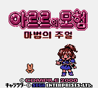
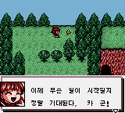
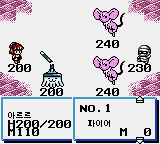

# 아르르의 모험 마법의 주얼 — 게임보이 컬러

[전체 마도물어 한글 패치 목록으로 돌아가기](../README.md)

게임보이 컬러용 《아르르의 모험 마법의 주얼》 일본판 한글 번역 패치입니다.

> **정식 배포 (v1.0.0)**

## 적용 방법

1. **일본판 원본 ROM**을 준비합니다 (아래 체크섬으로 올바른 파일인지 확인)
2. [Arle no Bouken - Mahou no Jewel (GBC) KR v1.0.0.bps](<https://raw.githubusercontent.com/mcpads/madou-monogatari-kr-patch/main/gbc-arle-no-bouken/Arle%20no%20Bouken%20-%20Mahou%20no%20Jewel%20(GBC)%20KR%20v1.0.0.bps>)를 다운로드합니다
3. [Floating IPS (Flips)](https://www.smwcentral.net/?p=section&a=details&id=11474) 등 BPS 패처로 일본판 원본 ROM에 한글 패치를 적용합니다

## 체크섬

| 구분 | SHA-256 |
| --- | --- |
| 원본 | `dcdfe0dd3c27e8da2eac40b7b1f692e16cbf5ff414476d7b05bdb958659b2bcd` |
| 패치 | `3ecdf11289cda2b05f8b0360b8b036aec6b0ad7924b6c0d0a540656a3f73af6a` |

## 패치 정보

- 사운드 테스트의 곡 제목은 원문을 유지합니다.
- KS X 1001 한글 2,350자 조합 이름 입력 지원
- [패처 코드베이스](https://github.com/mcpads/gbc-arle-no-bouken-kr-patcher)
