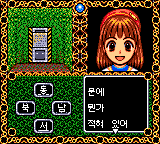

# 마도물어 A — 게임기어 (베타)

[전체 마도물어 한글 패치 목록으로 돌아가기](../README.md)

세가 게임기어 **마도물어 A (魔導物語A どきどきばけ〜しょん)** 한글 번역 패치입니다.

> ⚠️ **베타 배포 (v0.1.0)**: 전체 번역을 수록했으나 사람 최종 검수와 최종 인게임 검수가 진행 중입니다. 어색한 번역·표기·그래픽 문제나 진행 문제는 제보해 주세요.

참고: [마도물어 - 나무위키](https://namu.wiki/w/%EB%A7%88%EB%8F%84%EB%AC%BC%EC%96%B4)

## 적용 방법

1. **일본판 원본 ROM**을 준비합니다 (아래 체크섬으로 올바른 파일인지 확인)
2. [Madou Monogatari A (Game Gear) KR v0.1.0.bps](<Madou Monogatari A (Game Gear) KR v0.1.0.bps>)를 다운로드합니다
3. [Floating IPS (Flips)](https://github.com/Alcaro/Flips) 등 BPS 패처로 **일본판 원본 ROM**에 한글 패치를 직접 적용합니다

## 체크섬

### 원본 ROM — Madou Monogatari A - Dokidoki Vacation (Japan).gg

| 알고리즘 | 해시                                                               |
| -------- | ------------------------------------------------------------------ |
| CRC32    | `7EC95282`                                                         |
| MD5      | `ab0d1eb20ac63a984d874a885ca2588d`                                 |
| SHA-1    | `c027aa76fe0e09a2d1b982eea0df2c8b687aadf7`                         |
| SHA-256  | `6679b88d3db2ca62a78b1904cfe8364f7e6d5d74ffda27b7dbe49417ed2d02ec` |
| 크기     | 524,288 bytes (512 KB)                                             |

### KR 패치 파일 — Madou Monogatari A (Game Gear) KR v0.1.0.bps

| 알고리즘 | 해시                                                               |
| -------- | ------------------------------------------------------------------ |
| CRC32    | `2144DF1C`                                                         |
| MD5      | `e7249d6db45b10c11b7acdfd5bf813d3`                                 |
| SHA-1    | `f94b9c08f7169a218b636e23e8d5d6b9cc115db5`                         |
| SHA-256  | `97b1ecfe99ea5f4e03daae0f68831b4f43449651c82086a571c1d7f26cc08d73` |
| 크기     | 529,922 bytes (518 KB)                                             |

### KR 패치 적용 후 — Madou Monogatari A (Game Gear) KR v0.1.0.gg

| 알고리즘 | 해시                                                               |
| -------- | ------------------------------------------------------------------ |
| CRC32    | `A581A0DF`                                                         |
| MD5      | `6d2b2c79f69231d01f83f75c43966efa`                                 |
| SHA-1    | `fcac653b65b4c25684bb8254490d8c714176b801`                         |
| SHA-256  | `79203d5f751db6540d708041531a23b0da694f00d88b995adac3a1404fe68bb3` |
| 크기     | 1,048,576 bytes (1 MB)                                             |

## 패치 정보

- 일본판 원본에 직접 적용하는 JP→KR BPS
- 시나리오/이벤트 대사 번역, 시스템 UI 한글화
- 한글 폰트: [Dalmoori](https://github.com/RanolP/dalmoori-font) 8px 비트맵
- [패쳐 코드베이스](https://github.com/mcpads/gg-madoua-kr-patcher)

## 크레딧

- **패치 제작자**: mcpads
- **리버싱**: mcpads (with Claude Code, Codex)
- **한글 번역**: Claude Code (Opus 4.8), Codex (GPT-5.6 sol)
- **QA**: mcpads
- **역공학 참고**: [madouaggtools](https://github.com/suppertails66/madouaggtools) (Supper/Filler 영문 패치)
- **원작**: Compile (1996)
