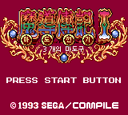
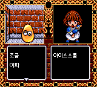

# 마도물어 I — 게임기어

[전체 마도물어 한글 패치 목록으로 돌아가기](../README.md)

세가 게임기어 **마도물어 I (魔導物語 I - 3つの魔導球)** 한글 번역 패치입니다.

> **정식 배포 (v1.1.1)**

참고: [마도물어 I - 나무위키](https://namu.wiki/w/%EB%A7%88%EB%8F%84%EB%AC%BC%EC%96%B4#s-3)

## 적용 방법

1. **일본판 원본 ROM**을 준비합니다 (아래 체크섬으로 올바른 파일인지 확인)
2. [Madou Monogatari I (Game Gear) KR v1.1.1.bps](<https://raw.githubusercontent.com/mcpads/madou-monogatari-kr-patch/main/gg-madou1/Madou%20Monogatari%20I%20(Game%20Gear)%20KR%20v1.1.1.bps>)를 다운로드합니다
3. [Floating IPS (Flips)](https://github.com/Alcaro/Flips) 등 BPS 패처로 **일본판 원본 ROM**에 한글 패치를 직접 적용합니다

## v1.1.1 변경 사항

- 엔딩 후반 대사 순서와 스태프롤 마지막 화면의 잔상·그림 손상 수정

## 체크섬

### 원본 ROM — Madou Monogatari I - 3-Tsu no Madoukyuu (Japan).gg

| 알고리즘 | 해시                                                               |
| -------- | ------------------------------------------------------------------ |
| CRC32    | `00C34D94`                                                         |
| MD5      | `abca338c5f08d06526d09b70588add2c`                                 |
| SHA-1    | `5ccd474cefcb8e086e2e1f77c0fdd5c1d2bf82e7`                         |
| SHA-256  | `4a87f02f358688bc7680d0d34f527e10a087fec95dbf7ed131241d8ffe4c0654` |
| 크기     | 524,288 bytes (512 KB)                                             |

### KR 패치 파일 — Madou Monogatari I (Game Gear) KR v1.1.1.bps

| 알고리즘 | 해시                                                               |
| -------- | ------------------------------------------------------------------ |
| CRC32    | `2144DF1C`                                                         |
| MD5      | `4eb1eed2e2b1ad370af57f3345f0729d`                                 |
| SHA-1    | `572900f94f1043146f67ee38d50cba80661c4d3a`                         |
| SHA-256  | `d61c5dafc840e51beea643a11cfbc2397a60b3176bf3805b9bbf8203d75c4338` |
| 크기     | 526,574 bytes (514 KB)                                             |

### KR 패치 적용 후 — Madou Monogatari I (Game Gear) KR v1.1.1.gg

| 알고리즘 | 해시                                                               |
| -------- | ------------------------------------------------------------------ |
| CRC32    | `96BCF8E4`                                                         |
| MD5      | `82e61f0dfec085c951731ce3e23fab60`                                 |
| SHA-1    | `9733d5d98834b9805c7b21e4734b25245ad60a7d`                         |
| SHA-256  | `b15554cb26b2276f718e8293f0c9f4372d74fa7558c9cbe77564d44ee9047c7c` |
| 크기     | 1,048,576 bytes (1 MB)                                             |

## 진행 상황

- [x] 일본어 폰트 추출 및 테이블 완성
- [x] 시나리오 텍스트 추출
- [x] 시나리오 및 이벤트 대사 번역
- [x] 한글 폰트 통합 및 적용
- [x] 시스템 UI
- [x] 시스템 안정성
- [x] 플레이 테스트 및 최종 인게임 검수

## 패치 정보

- 시나리오/이벤트 대사 및 시스템 UI 한글화
- 한글 폰트: [Dalmoori](https://github.com/RanolP/dalmoori-font) 8px 비트맵
- [패쳐 코드베이스](https://github.com/mcpads/gg-madou1-kr-patcher)

## 크레딧

- **패치 제작자**: mcpads
- **리버싱**: mcpads (with Claude Code)
- **한글 번역**: Claude Code (Opus 4.8)
- **QA**: mcpads
- **역공학 참고**: 게임기어 영문 번역 패치 (English v1.0, Hardware Fix)
- **원작**: Compile (1993)
