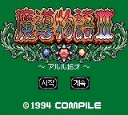
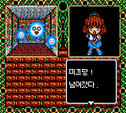

# 마도물어 II — 게임기어

[전체 마도물어 한글 패치 목록으로 돌아가기](../README.md)

세가 게임기어 **마도물어 II - 아르르 16세 (魔導物語 II - アルル16才)** 한글 번역 패치입니다.

> **정식 배포 (v1.0.0)**

참고: [마도물어 - 나무위키](https://namu.wiki/w/%EB%A7%88%EB%8F%84%EB%AC%BC%EC%96%B4)

## 적용 방법

1. **일본판 원본 ROM**을 준비합니다 (아래 체크섬으로 올바른 파일인지 확인)
2. [Madou Monogatari II (Game Gear) KR v1.0.0.bps](<https://raw.githubusercontent.com/mcpads/madou-monogatari-kr-patch/main/gg-madou2/Madou%20Monogatari%20II%20(Game%20Gear)%20KR%20v1.0.0.bps>)를 다운로드합니다
3. [Floating IPS (Flips)](https://github.com/Alcaro/Flips) 등 BPS 패처로 **일본판 원본 ROM**에 한글 패치를 직접 적용합니다

## 체크섬

### 원본 ROM — Madou Monogatari II - Arle 16-Sai (Japan).gg

| 알고리즘 | 해시                                                               |
| -------- | ------------------------------------------------------------------ |
| CRC32    | `12EB2287`                                                         |
| MD5      | `81a57f26b7a1ccaa21bf7678b3596cb2`                                 |
| SHA-1    | `deead79fa4cb2e87652a9c8a76f2a7174f48f37a`                         |
| SHA-256  | `9da7d65d1772ae9b5fa71cee68b19f78bfc4848451ad6bbb5662498b2dbb997a` |
| 크기     | 524,288 bytes (512 KB)                                             |

### KR 패치 파일 — Madou Monogatari II (Game Gear) KR v1.0.0.bps

| 알고리즘 | 해시                                                               |
| -------- | ------------------------------------------------------------------ |
| CRC32    | `2144DF1C`                                                         |
| MD5      | `303635310cd1095f1779a5864bea31fb`                                 |
| SHA-1    | `d77c73731b04e52a97d251ff116c9fed5a23edf2`                         |
| SHA-256  | `4edebcf1db4b33eacdbaf8353a43aca1df4401917c226a9397323acd79162cde` |
| 크기     | 526,665 bytes (514 KB)                                             |

### KR 패치 적용 후 — Madou Monogatari II (Game Gear) KR v1.0.0.gg

| 알고리즘 | 해시                                                               |
| -------- | ------------------------------------------------------------------ |
| CRC32    | `C0F7BF83`                                                         |
| MD5      | `d1dabdc3a90995928627134988308735`                                 |
| SHA-1    | `2475f582004769a648adb11c7d83944a95100d54`                         |
| SHA-256  | `405560e45b88048798f610ec2578f6300aff037dc1d4c4960de12965bc7a72f7` |
| 크기     | 1,048,576 bytes (1 MB)                                             |

## 진행 상황

- [x] 일본어 폰트 추출 및 테이블 완성
- [x] 시나리오 텍스트 추출 및 확장 뱅크 재배치
- [x] 시나리오 및 이벤트 대사 번역
- [x] 한글 폰트 통합 및 렌더러 훅
- [x] 시스템 UI
- [x] 시스템 안정성
- [x] 플레이 테스트 및 최종 인게임 검수

## 패치 정보

- 시나리오/이벤트 대사 번역, 시스템 UI 한글화
- 한글 폰트: [Dalmoori](https://github.com/RanolP/dalmoori-font) 8px 비트맵
- [패쳐 코드베이스](https://github.com/mcpads/gg-madou2-kr-patcher)

## 크레딧

- **패치 제작자**: mcpads
- **리버싱**: mcpads (with Claude Code)
- **한글 번역**: Claude Code (Opus 4.8)
- **QA**: mcpads
- **원작**: Compile (1994)
