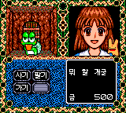

# 마도물어 III — 게임기어 (베타)

[전체 마도물어 한글 패치 목록으로 돌아가기](../README.md)

세가 게임기어 **마도물어 III - 궁극의 여왕님 (魔導物語 III - 究極の女王様)** 한글 번역 패치입니다.

> ⚠️ **베타 배포 (v0.1.0)**: 게임 전반은 정상 플레이 가능하나 최종 인게임 검수가 진행 중입니다. 어색한 번역·표기·그래픽 문제는 제보해 주세요.

참고: [마도물어 - 나무위키](https://namu.wiki/w/%EB%A7%88%EB%8F%84%EB%AC%BC%EC%96%B4)

## 적용 방법

1. **일본판 원본 ROM**을 준비합니다 (아래 체크섬으로 올바른 파일인지 확인)
2. [Madou Monogatari III (Game Gear) KR v0.1.0.bps](https://raw.githubusercontent.com/mcpads/madou-monogatari-kr-patch/main/Madou%20Monogatari%20III%20(Game%20Gear)%20KR%20v0.1.0.bps)를 다운로드합니다
3. [Floating IPS (Flips)](https://github.com/Alcaro/Flips) 등 BPS 패처로 **일본판 원본 ROM**에 한글 패치를 직접 적용합니다

## 체크섬

### 원본 ROM — Madou Monogatari III - Kyuukyoku Joou-sama (Japan).gg

| 알고리즘 | 해시                                                               |
| -------- | ------------------------------------------------------------------ |
| CRC32    | `0A634D79`                                                         |
| MD5      | `b8b5305ec2f68d7bb3c9f622a13eba7c`                                 |
| SHA-1    | `dd590c9086161b1f97573c48720c32cc5506dabc`                         |
| SHA-256  | `a02710b5cbf71e49a3aaa18c1e28be769bb634139fd987101c448575467f8ca3` |
| 크기     | 524,288 bytes (512 KB)                                             |

### KR 패치 파일 — Madou Monogatari III (Game Gear) KR v0.1.0.bps

| 알고리즘 | 해시                                                               |
| -------- | ------------------------------------------------------------------ |
| CRC32    | `2144DF1C`                                                         |
| MD5      | `463b00a65eefc0a52e6b69017703091a`                                 |
| SHA-1    | `b0d56d7917b22a294f42032ddb2029b3f80c8926`                         |
| SHA-256  | `62203cae2c958f35731d03337a2fe20833844437370b4a69b3fab47115edd981` |
| 크기     | 526,244 bytes (514 KB)                                             |

### KR 패치 적용 후 — Madou Monogatari III (Game Gear) KR v0.1.0.gg

| 알고리즘 | 해시                                                               |
| -------- | ------------------------------------------------------------------ |
| CRC32    | `76AE7609`                                                         |
| MD5      | `c365ff7a14da95ad206101f640e63441`                                 |
| SHA-1    | `e28a58a9b09c90a3dd9de0ea4422566d110f701f`                         |
| SHA-256  | `8fe5571ca714904f3909a60e38466884e83f93e4bc5233475a27469d61f20a88` |
| 크기     | 1,048,576 bytes (1 MB)                                             |

## 진행 상황

- [x] 일본어 폰트 추출 및 테이블 완성
- [x] 시나리오 텍스트 추출 및 확장 뱅크 재배치
- [x] 시나리오 및 이벤트 대사 번역
- [x] 한글 폰트 통합 및 렌더러 훅
- [x] 시스템 UI
- [x] 시스템 안정성
- [ ] 플레이 테스트 및 최종 인게임 검수 (진행 중)

## 패치 정보

- 시나리오/이벤트 대사 번역, 시스템 UI 한글화
- 한글 폰트: [Dalmoori](https://github.com/RanolP/dalmoori-font) 8px 비트맵
- [패쳐 코드베이스](https://github.com/mcpads/gg-madou3-kr-patcher)

## 크레딧

- **패치 제작자**: mcpads
- **리버싱**: mcpads (with Claude Code)
- **한글 번역**: Claude Code (Opus 4.8)
- **QA**: mcpads
- **원작**: Compile (1994)
