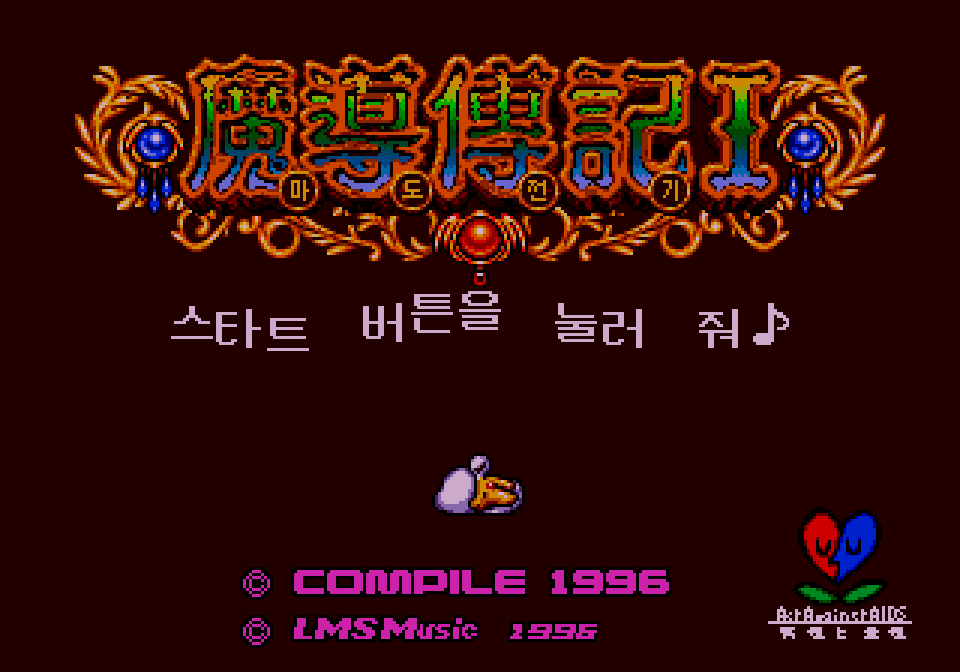
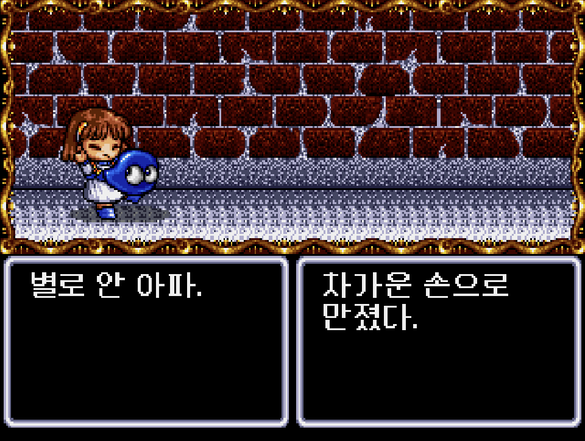

# 마도물어 I — 메가드라이브

[전체 마도물어 한글 패치 목록으로 돌아가기](../README.md)

세가 메가드라이브(Genesis) **마도물어 I (魔導物語 I)** 한글 번역 패치입니다.

일본판 원본에 직접 적용하는 `v2.0.0` 패치입니다.

참고: [마도물어 I - 나무위키](https://namu.wiki/w/%EB%A7%88%EB%8F%84%EB%AC%BC%EC%96%B4#s-3)

## 적용 방법

1. **일본판 원본 ROM**을 준비합니다 (아래 체크섬으로 올바른 파일인지 확인)
2. [Madou Monogatari I (Mega Drive) KR v2.0.0.bps](<https://raw.githubusercontent.com/mcpads/madou-monogatari-kr-patch/main/md-madou1/Madou%20Monogatari%20I%20(Mega%20Drive)%20KR%20v2.0.0.bps>)를 다운로드합니다
3. [Floating IPS (Flips)](https://www.smwcentral.net/?p=section&a=details&id=11474) 등 BPS 패처로 일본판 원본 ROM에 한글 패치를 적용합니다

## 체크섬

### 원본 ROM - Madou Monogatari I (Japan).md

| 알고리즘 | 해시                                                               |
| -------- | ------------------------------------------------------------------ |
| CRC32    | `DD82C401`                                                         |
| MD5      | `41B8BA3569E3F4F98155DEA64318D223`                                 |
| SHA-1    | `143456600E44F543796CF6ADE77830115A8F2F99`                         |
| SHA-256  | `61d1dec319afb1380dfbee0cdb42e6e64ab180941b0d533d8deed9efa502f83c` |
| 크기     | 2,097,152 bytes (2 MB)                                             |

### KR 패치 파일 — Madou Monogatari I (Mega Drive) KR v2.0.0.bps

| 알고리즘 | 해시                                                               |
| -------- | ------------------------------------------------------------------ |
| CRC32    | `2144DF1C`                                                         |
| MD5      | `c2b5558834218b26a6b5a5e41a8b4b40`                                 |
| SHA-1    | `0f01cc8f9df5553a22d3fbc03adf90b206aeb9e0`                         |
| SHA-256  | `22317cdbdee27b49ba5b5d062194f164240048d57380635459db836808100883` |
| 크기     | 2,114,029 bytes (2.02 MB)                                          |

### KR 패치 적용 후 — Madou Monogatari I (Mega Drive) KR v2.0.0.md

| 알고리즘 | 해시                                                               |
| -------- | ------------------------------------------------------------------ |
| CRC32    | `25B16835`                                                         |
| MD5      | `db44e12ed031f4632017c3c8a0e3c3e4`                                 |
| SHA-1    | `d0ae5a807e874e666d424ed749feb6c58df892bf`                         |
| SHA-256  | `863c787cad2ccbc2ba124bee32aec4d23e7c7046305bbf7e3eb1382a0ee25eef` |
| 크기     | 4,194,304 bytes (4 MB)                                             |

## 패치 정보

- 일본판 원본에 직접 적용하는 JP→KR 패치
- 한글 폰트: [Neo둥근모](https://neodgm.dalgona.dev/), [Galmuri](https://github.com/quiple/galmuri)
- [패쳐 코드베이스](https://github.com/mcpads/md-madou-kr-patcher)

## 크레딧

- **패치 제작자**: mcpads
- **리버싱**: mcpads (with Claude Code, Codex)
- **QA**: mcpads
- **한글 번역**: Claude Code (Opus 4.6 및 Haiku 4.5), Codex (GPT 5.6-sol)
- **영어 번역 (베이스)**: [LIPEMCO! Translations](https://stargood.org/trans/lipemco.php)
- **원작**: Compile (1996)
