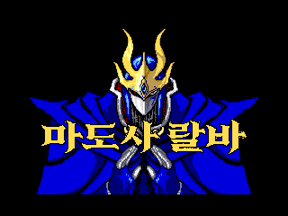
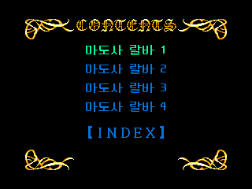
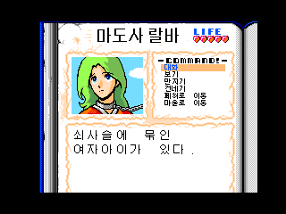

# 마도사 랄바 — MSX2

[전체 마도물어 한글 패치 목록으로 돌아가기](../README.md)

MSX2 **마도사 랄바 총집편**(디스크 스테이션 디럭스 2호 수록) 한글 번역 패치입니다.

> ⚠️ **베타 배포 (v0.1.0)**: 번역·표기·그래픽과 패치 내용은 추후 변경될 수 있으며, 일부 조건에서 문제가 발생할 수 있습니다.

## 적용 방법

1. 아래 체크섬과 일치하는 일본판 원본 **Disk 1** DSK를 준비합니다. Disk 2는 필요하지 않습니다.
2. [Madoushi Lulba (MSX2) KR v0.1.0.bps](https://raw.githubusercontent.com/mcpads/madou-monogatari-kr-patch/main/msx2-lulba/Madoushi%20Lulba%20%28MSX2%29%20KR%20v0.1.0.bps)를 다운로드합니다.
3. BPS 지원 패처에서 **원본 DSK 전체**에 패치를 적용하고 새 DSK로 저장합니다. ZIP이나 DSK 내부 파일에 적용하지 마세요.
4. 생성된 DSK로 게임을 실행합니다.

진행 상황은 같은 디스크에 저장되므로, **한 번이라도 저장한 디스크에는 패치가 적용되지 않습니다.** 저장한 적 없는 원본을 사용하고 원본은 별도로 보관하세요.

## 체크섬

### 원본 DSK — Disc Station MSX DX #2 (COMPILE) Disk_1.dsk

| 항목 | 값 |
| --- | --- |
| SHA-256 | `b4fcdddda106bac11a56426ab1f2822b38a5415aa9b599737e424ec765db904e` |
| CRC32 | `7D5B3716` |
| 크기 | 737,280 bytes |

### 배포 패치 v0.1.0

| 항목 | 값 |
| --- | --- |
| SHA-256 | `8b920d6e69b12aaa2da5554357870b0fdf7f7f10ad47e5030b9e1e5af5f5223a` |
| 크기 | 42,507 bytes |

## 패치 정보

- 대사·선택지 한글화
- 타이틀·목차·대화창 제목·효과음 등 그래픽 한글화 (영문 표기는 원형 유지)

## 크레딧

- **패치 제작자**: mcpads
- **원작**: Compile
- **글꼴**: [Galmuri](https://github.com/quiple/galmuri), [Neo둥근모](https://github.com/neodgm/neodgm), [검은고딕](https://github.com/google/fonts/tree/main/ofl/blackhansans) (SIL Open Font License 1.1)
