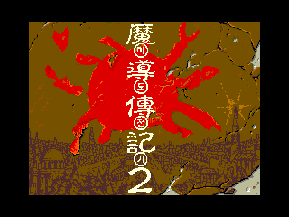
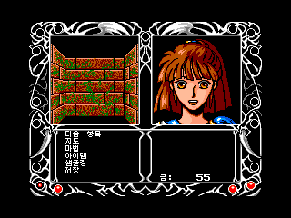
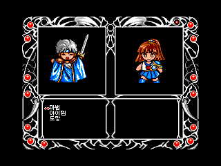

# 마도물어 II — MSX2

[전체 마도물어 한글 패치 목록으로 돌아가기](../README.md)

MSX2 **마도물어 II** 한글 번역 패치입니다.

> ⚠️ **베타 배포 (v0.1.0)**: 번역·표기·그래픽과 패치 내용은 추후 변경될 수 있으며, 일부 조건에서 문제가 발생할 수 있습니다.

## 적용 방법

1. 아래 체크섬과 일치하는 일본판 원본 DSK를 준비합니다.
2. [Madou Monogatari II (MSX2) KR v0.1.0.bps](https://raw.githubusercontent.com/mcpads/madou-monogatari-kr-patch/main/msx2-madou2/Madou%20Monogatari%20II%20%28MSX2%29%20KR%20v0.1.0.bps)를 다운로드합니다.
3. BPS 지원 패처에서 **원본 DSK 전체**에 패치를 적용하고 새 DSK로 저장합니다. ZIP이나 DSK 내부 파일에 적용하지 마세요.
4. 생성된 DSK를 게임 디스크로 사용합니다. **저장용 데이터 디스크에는 패치를 적용하지 않습니다.**

원본 디스크와 기존 저장 데이터는 별도로 보관하세요.

## 체크섬

### 원본 DSK — Madou Monogatari 2.dsk

| 항목 | 값 |
| --- | --- |
| SHA-256 | `97cd87989e7623e5d6f8aa2d3e0eb98fb318a0d6da190a1563b011e8ff372a8c` |
| 크기 | 737,280 bytes |

### 배포 패치 v0.1.0

| 항목 | 값 |
| --- | --- |
| SHA-256 | `f6883dd8fe817861516635da13bc8a00d41a883a7908ba6ceae03f388f63cf94` |
| 크기 | 37,952 bytes |

## 패치 정보

- 대사·메뉴·타이틀·스태프롤 한글화

## 크레딧

- **패치 제작자**: mcpads
- **원작**: Compile
