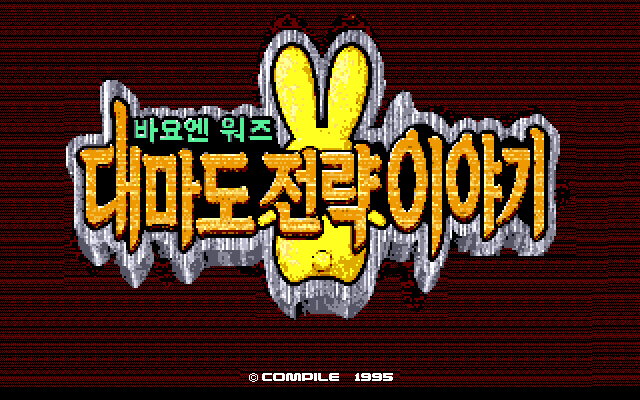

# 바요엔워즈 대마도전략물어 — PC-98

[전체 마도물어 한글 패치 목록으로 돌아가기](../README.md)

Disc Station Vol. 05 수록작 《바요엔워즈 대마도전략물어》의 PC-98 한글 번역 패치입니다.

> ⚠️ **베타 배포 (v0.1.0)**: 번역과 그래픽은 이후 배포에서 변경될 수 있습니다.

## 배포 파일

| 다운로드 | SHA-256 |
| --- | --- |
| [Bayoen Wars (PC-98) KR v0.1.0.zip](<https://raw.githubusercontent.com/mcpads/madou-monogatari-kr-patch/main/pc98-bayoen-wars/Bayoen%20Wars%20(PC-98)%20KR%20v0.1.0.zip>) | `67dd45045881046f7cca0255f18d6709de1903c5823e3497334509cc2c42de59` |

패치 ZIP은 압축을 풀지 않고 웹 패처에서 그대로 선택합니다.

## 지원 원본

Disc Station Vol. 05 Disk 1의 헤더 없는 원본 HDM을 지원합니다.

| 항목 | 값 |
| --- | --- |
| 크기 | 1,261,568 bytes |
| SHA-256 | `94f73ae53493719d983dadae3adbade79ee8174789de6b817edf09670b94b558` |

파일명이 달라도 크기와 SHA-256이 일치하면 사용할 수 있습니다.

## 적용 방법

1. 원본 HDM을 별도 위치에 백업합니다.
2. 위의 패치 ZIP을 다운로드합니다.
3. [RetroGame Patcher](https://patcher.retrogame.cloud/)를 엽니다.
4. 패치 ZIP을 먼저 선택한 다음 원본 HDM을 선택합니다.
5. **검사하고 적용하기**를 누르고, 검사가 끝나면 완성된 `bayoen-wars-ko-0.1.0.hdm`을 내려받습니다.

패치 ZIP과 원본·결과 HDM은 서버로 전송되지 않고 브라우저 안에서 처리됩니다.

## 실행 방법

패처가 만든 HDM은 Disc Station 셸을 거치지 않는 독립 실행 디스크입니다. 해당 디스크를 PC-98의 FDD1에서 부팅합니다.

## 패치 정보

- 원본 설치기에서 필요한 게임 파일을 읽고 파일별 BPS를 적용해 독립 실행 HDM을 만듭니다.
- [웹 패처 소스 코드](https://github.com/mcpads/retro-patcher)
