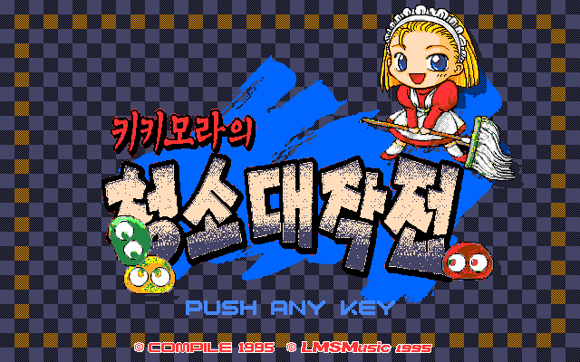

# 키키모라의 청소 대작전 — PC-98 (베타)

[전체 한글 패치 목록으로 돌아가기](../README.md)

Disc Station Vol. 07 수록작 《키키모라의 청소 대작전》의 PC-98 한글 번역 베타 패치입니다.

> ⚠️ **베타 배포 (v0.1.0)**: 번역과 그래픽은 이후 배포에서 변경될 수 있습니다.

## 배포 파일

| 다운로드 | SHA-256 |
| --- | --- |
| [Kikimora no Osouji Daisakusen (PC-98) KR v0.1.0.zip](<Kikimora no Osouji Daisakusen (PC-98) KR v0.1.0.zip>) | `0638d42c1993be02c56c6c6a995f74568a7867ce6c7e3aafc21db42e6525b69a` |

패치 ZIP은 압축을 풀지 않고 웹 패처에서 그대로 선택합니다.

## 지원 원본

Disc Station Vol. 07 Disk 1의 다음 원본 HDM을 지원합니다.

| 항목 | 값 |
| --- | --- |
| 크기 | 1,261,568 bytes |
| SHA-256 | `2a206b3110e70110a9a26a29230a9e43bce8b1b72ab43117ab04ab1b99652bdf` |

파일명이 달라도 크기와 SHA-256이 일치하면 사용할 수 있습니다.

## 적용 방법

1. 원본 HDM을 별도 위치에 백업합니다.
2. 위의 패치 ZIP을 다운로드합니다.
3. [RetroGame Patcher](https://patcher.retrogame.cloud/)를 엽니다.
4. 패치 ZIP을 먼저 선택한 다음 원본 HDM을 선택합니다.
5. **검사하고 적용하기**를 누르고, 검사가 끝나면 완성된 HDM을 내려받습니다.

패치 ZIP과 원본·결과 HDM은 서버로 전송되지 않고 브라우저 안에서 처리됩니다.

## 패치 정보

- 원본 설치기에서 필요한 게임 파일을 읽고 파일별 BPS를 적용해 독립 실행 HDM을 만듭니다.
- [웹 패처 소스 코드](https://github.com/mcpads/pc98-fat12-patcher-tool)
