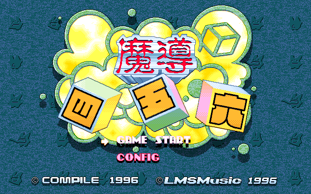

# 마도 사오륙 — PC-98 (베타)

[전체 마도물어 한글 패치 목록으로 돌아가기](../README.md)

Disc Station Vol. 09 수록작 《마도 사오륙》의 PC-98 한글 번역 베타 패치입니다.

> ⚠️ **베타 배포 (v0.1.0)**: 번역과 그래픽은 이후 배포에서 변경될 수 있습니다.

## 배포 파일

| 다운로드 | SHA-256 |
| --- | --- |
| [Madou 456 (PC-98) KR v0.1.0.zip](<https://raw.githubusercontent.com/mcpads/madou-monogatari-kr-patch/main/pc98-madou-456/Madou%20456%20(PC-98)%20KR%20v0.1.0.zip>) | `097a50ed5af9d1125938d19018c66f41521d76bdda0e720c6ba92629df1395d4` |

패치 ZIP은 압축을 풀지 않고 웹 패처에서 그대로 선택합니다.

## 지원 원본

Disc Station Vol. 09의 raw Mode 1/2352 CD 이미지를 지원합니다. 파일명은 달라도 되지만 크기와 SHA-256이 모두 일치해야 합니다.

| 원본 | 크기 | SHA-256 |
| --- | ---: | --- |
| Disc Station Vol. 09 CD 이미지 | `46,901,232`바이트 | `a288832c3f1ff2ff457f457d2db450eb27d8bb24f902e1dd886322aeb097c7db` |

## 적용 방법

1. 원본 CD 이미지를 별도 위치에 백업합니다.
2. 위의 패치 ZIP을 다운로드합니다.
3. [RetroGame Patcher](https://patcher.retrogame.cloud/)를 엽니다.
4. 패치 ZIP을 먼저 선택한 다음 원본 CD 이미지를 선택합니다.
5. 원본이 인식되면 **검사하고 적용하기**를 누릅니다.
6. 적용이 끝나면 생성된 `madou456-ko-0.1.0.iso`를 내려받습니다.

패치 ZIP과 원본·결과 이미지는 서버로 전송되지 않고 브라우저 안에서 처리됩니다.

## 실행 방법

생성된 ISO는 부팅 디스크가 아닙니다. PC-98에서 CD-ROM으로 사용한 뒤, DOS에서 `MADOU456` 디렉터리의 `456.BAT`를 실행합니다.

## 패치 정보

- 원본 CD의 `DS9_DATA/MADOU456`에서 게임 파일을 읽고 파일별 BPS를 적용해 ISO를 만듭니다.
- [웹 패처 소스 코드](https://github.com/mcpads/retro-patcher)
