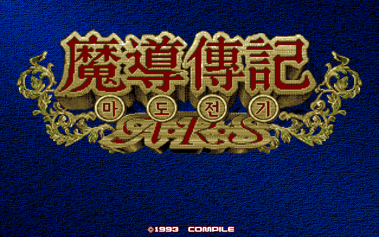

# 마도물어 A.R.S — PC-98

[전체 마도물어 한글 패치 목록으로 돌아가기](../README.md)

PC-98용 《마도물어 A.R.S》의 한글 번역 패치입니다.

> ⚠️ **베타 배포 (v0.1.1)**: 번역과 그래픽은 이후 배포에서 변경될 수 있습니다.

## 배포 파일

| 다운로드 | SHA-256 |
| --- | --- |
| [Madou Monogatari A.R.S (PC-98) KR v0.1.1.zip](<https://raw.githubusercontent.com/mcpads/madou-monogatari-kr-patch/main/pc98-madou-ars/Madou%20Monogatari%20A.R.S%20(PC-98)%20KR%20v0.1.1.zip>) | `cd2bdaf91d09e6c218ecdef31ddcd6b35efc56cac40400504150f72b50f7a974` |

패치 세트 ZIP은 압축을 풀지 않고 웹 패처에서 그대로 선택합니다.

## 지원 원본

플로피 디스크판의 헤더 없는 원본 HDM 일곱 장을 지원합니다. 파일명은 달라도 되지만 크기와 SHA-256이 모두 일치해야 합니다. HDI와 D88 변환본은 지원하지 않습니다.

모든 원본 HDM의 크기는 `1,261,568`바이트입니다.

| 디스크 | SHA-256 |
| --- | --- |
| Demo | `185e1ea0e482f512971de4f41d41656c28b46f26cd69ea16e2a3362a10d6f56d` |
| Arle Game | `42113b22b028ce31c6319f301e29fdfc90ce27a91855d9e082547b1e229965fc` |
| Arle Data | `94d346dfdf793589f2630026770045ef6a25783112d896486e68d9d364e05281` |
| Rulue Game | `d629dc818533e9e0347fc83e0eab16cdd2388657636285c4c8d254ed087d2f89` |
| Rulue Data | `6e55fbaad1cf3b6f9ccaac54c09e86177cf2cd7350622e036599cf1754cdc428` |
| Schezo Game | `53c746d3c1bf8eaee16a96d9c29c2100e4b09ca405f3e57a1eb9059daedfb584` |
| Schezo Data | `fc12290819c86fd6fe8dd432d63aabcb6d40d93f94de0ced9de2b2c65666c489` |

## 적용 방법

1. 원본 HDM 일곱 장을 별도 위치에 백업합니다.
2. 위의 패치 세트 ZIP을 다운로드합니다.
3. [RetroGame Patcher](https://patcher.retrogame.cloud/)를 엽니다.
4. 패치 세트 ZIP을 먼저 선택한 다음 원본 HDM 일곱 장을 선택합니다. 파일명과 선택 순서는 상관없습니다.
5. 일곱 원본이 모두 인식되면 **검사하고 적용하기**를 누릅니다.
6. 적용이 끝나면 완성된 HDM 일곱 장을 내려받습니다.

패치 ZIP과 원본·결과 HDM은 서버로 전송되지 않고 브라우저 안에서 처리됩니다.

## 실행 방법

캐릭터별 플레이에는 해당 캐릭터의 Game·Data 디스크와 공용 Demo 디스크를 사용합니다.

1. FDD1에 플레이할 캐릭터의 Game 디스크, FDD2에 Demo 디스크를 넣고 PC-98을 시작합니다.
2. Data 디스크를 요구하면 FDD2의 Demo 디스크를 해당 캐릭터의 Data 디스크로 교체합니다.
3. 세이브용 User 디스크는 패치하지 않고 원본을 그대로 사용합니다.

## 패치 정보

- 일곱 원본에서 필요한 게임 파일을 읽고 파일별 BPS를 적용해 각각의 완성 HDM을 만듭니다.
- [웹 패처 소스 코드](https://github.com/mcpads/retro-patcher)
