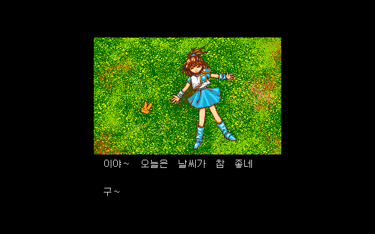
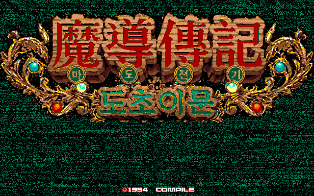
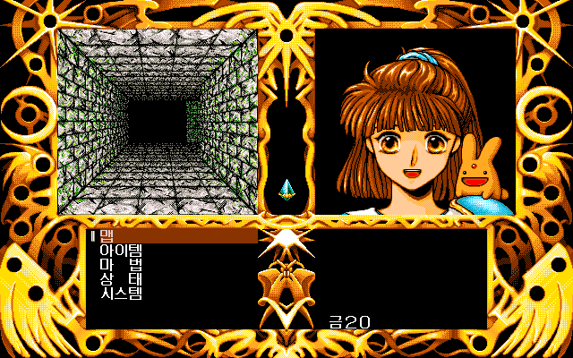

# 마도물어 도초이문 — PC-98

[전체 마도물어 한글 패치 목록으로 돌아가기](../README.md)

Disc Station 3호 수록작 《마도물어 ~도초이문~》의 PC-98 한글 번역 패치입니다.

> **정식 배포 (v1.0.0)**

## 배포 파일

| 다운로드 | SHA-256 |
| --- | --- |
| [Madou Monogatari - Michikusa Ibun (PC-98) KR v1.0.0.zip](<https://raw.githubusercontent.com/mcpads/madou-monogatari-kr-patch/main/pc98-madou-docho/Madou%20Monogatari%20-%20Michikusa%20Ibun%20(PC-98)%20KR%20v1.0.0.zip>) | `7789bea08a802693c98c2effaea30ab57ce89e2d9d6d5e2a281a2d8bdf90ecd6` |

패치 ZIP은 압축을 풀지 않고 웹 패처에서 그대로 선택합니다.

## 지원 원본

Disc Station Vol. 03 Disk 1의 다음 원본 HDM을 지원합니다.

| 항목 | 값 |
| --- | --- |
| 크기 | 1,261,568 bytes |
| SHA-256 | `2ba5ada68e76a74a2659484174b79ebf9a2c8285fab650e11a5340698d78b22e` |

파일명이 달라도 크기와 SHA-256이 일치하면 사용할 수 있습니다.

## 적용 방법

1. 원본 HDM을 별도 위치에 백업합니다.
2. 위의 패치 ZIP을 다운로드합니다.
3. [RetroGame Patcher](https://patcher.retrogame.cloud/)를 엽니다.
4. 패치 ZIP을 먼저 선택한 다음 원본 HDM을 선택합니다.
5. **검사하고 적용하기**를 누르고, 검사가 끝나면 완성된 HDM을 내려받습니다.

패치 ZIP과 원본·결과 HDM은 서버로 전송되지 않고 브라우저 안에서 처리됩니다.

## 실행 방법

패처가 만든 HDM은 Disc Station 셸을 거치지 않는 독립 실행 디스크입니다. 해당 디스크를 PC-98의 FDD1에서 부팅합니다.

## 패치 정보

- 시나리오·전투·메뉴·오프닝·타이틀·엔딩 한글화
- Disc Station 4호에 수록된 공식 프리징 수정 포함
- 원본 설치기에서 필요한 게임 파일을 읽고 파일별 BPS를 적용해 독립 실행 HDM을 만듭니다.
- [웹 패처 소스 코드](https://github.com/mcpads/retro-patcher)
