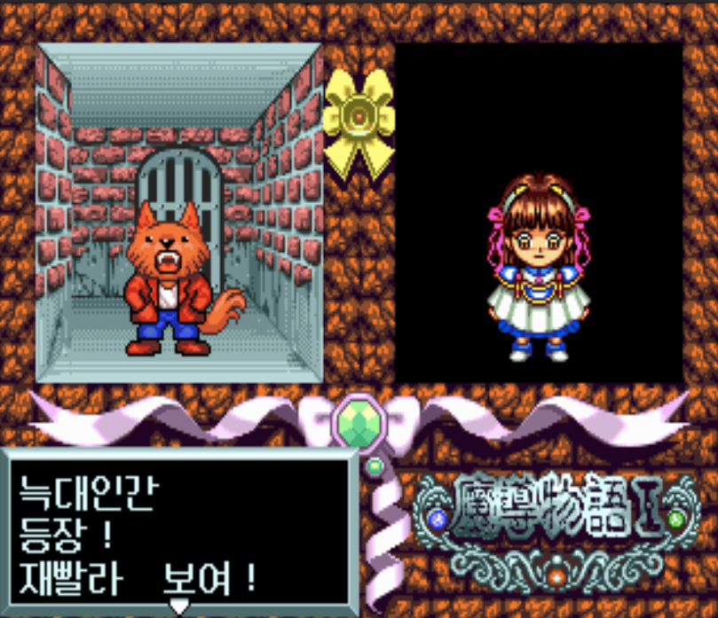

# 마도물어 I — PC 엔진 CD

[전체 마도물어 한글 패치 목록으로 돌아가기](../README.md)

PC 엔진 CD-ROM² **마도물어 I - 불꽃의 꼬마 졸업생 (魔導物語I 炎の卒園児)** 한글 번역 패치입니다. 일본판 원본에 직접 적용합니다.

> **정식 배포 (v1.0.1)**

## 적용 방법

1. 아래 체크섬과 일치하는 일본판 원본 32트랙 BIN/CUE를 준비합니다
2. [Madou Monogatari I - Honoo no Sotsuenji (PC Engine CD) KR v1.0.1.bps](<https://raw.githubusercontent.com/mcpads/madou-monogatari-kr-patch/main/pce-madou1/Madou%20Monogatari%20I%20-%20Honoo%20no%20Sotsuenji%20(PC%20Engine%20CD)%20KR%20v1.0.1.bps>)를 다운로드합니다
3. [Floating IPS (Flips)](https://github.com/Alcaro/Flips) 등 BPS 패처로 패치를 **원본 `(Track 02).bin`에만** 적용합니다. CUE, 전체 디스크 합본, ISO/2048 파일에는 적용하지 않습니다
4. 패치 적용 후 파일을 원본 `(Track 02).bin`과 같은 이름으로 두면 기존 CUE를 그대로 사용할 수 있습니다. Track 01과 Track 03~32는 원본 그대로 유지합니다

## 체크섬

### 원본 Track 02 — Madou Monogatari I - Honoo no Sotsuenji (Japan) (Track 02).bin

| 알고리즘 | 해시                                                               |
| -------- | ------------------------------------------------------------------ |
| CRC32    | `146E1E2B`                                                         |
| MD5      | `a0819940f217c31439b56393d2c15df5`                                 |
| SHA-1    | `754696b6527c12259280e82f9233d555f1157340`                         |
| SHA-256  | `6cd2603393679e8a236940853d52db45d689952d88bda3445da9aefe63b38564` |
| 크기     | 41,150,592 bytes                                                   |

### KR 패치 파일 — Madou Monogatari I - Honoo no Sotsuenji (PC Engine CD) KR v1.0.1.bps

| 알고리즘 | 해시                                                               |
| -------- | ------------------------------------------------------------------ |
| CRC32    | `2144DF1C`                                                         |
| MD5      | `38a09626d509c691d50848e80710340f`                                 |
| SHA-1    | `de290fdd9dfc3c4c059262e5147189d47c091b4d`                         |
| SHA-256  | `190df561de8dd38840fe81d9047b78ea5150c398590c2572aa78031ddce8f16f` |
| 크기     | 316,926 bytes                                                      |

### KR 패치 적용 후 Track 02 — Madou Monogatari I - Honoo no Sotsuenji (PC Engine CD) KR v1.0.1 (Track 02).bin

| 알고리즘 | 해시                                                               |
| -------- | ------------------------------------------------------------------ |
| CRC32    | `8FAFAFE1`                                                         |
| MD5      | `4c356850fecbbdf9383714d36cdcb7ad`                                 |
| SHA-1    | `f02e4f24cdca1f960f229e9782793c861717400f`                         |
| SHA-256  | `557393a1660dba6b8343a49863b213ecc19d954674dbb24d3846c5c92617bb72` |
| 크기     | 41,150,592 bytes                                                   |

## 패치 정보

- 일본판 원본 raw MODE1/2352 Track 02에 직접 적용하는 JP→KR BPS
- 시나리오·시스템 UI·컷신 자막·타이틀 한글화
- 일반 대사·메뉴 한글 폰트: [Neo둥근모](https://neodgm.dalgona.dev/) 16px 비트맵
- 컷신 자막 한글 폰트: Maplestory Bold
- [패쳐 코드베이스](https://github.com/mcpads/pce-madou1-kr-patcher)

## 크레딧

- **패치 제작자**: mcpads
- **원작**: Compile / NEC Avenue (1996)
