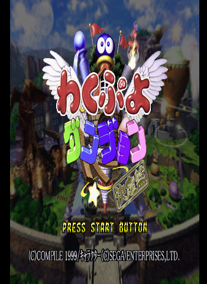

# 와쿠와쿠 뿌요뿌요 던전 완전판 — PlayStation

[전체 마도물어 한글 패치 목록으로 돌아가기](../README.md)

PlayStation용 《와쿠와쿠 뿌요뿌요 던전 완전판》 일본판 한글 번역 패치입니다.

> ⚠️ **베타 배포 (v0.1.0)**: 번역·표기·그래픽과 패치 내용은 추후 변경될 수 있으며, 게임 진행 중 오류가 발생할 수 있습니다.

## 적용 방법

1. 아래 체크섬과 일치하는 일본판 원본 BIN/CUE를 준비합니다
2. [Waku Puyo Dungeon - Ketteiban (PlayStation) KR v0.1.0.bps](<https://raw.githubusercontent.com/mcpads/madou-monogatari-kr-patch/main/ps1-waku-puyo/Waku%20Puyo%20Dungeon%20-%20Ketteiban%20(PlayStation)%20KR%20v0.1.0.bps>)를 다운로드합니다
3. [Floating IPS (Flips)](https://www.smwcentral.net/?p=section&a=details&id=11474) 등 BPS 패처로 원본 BIN에 한글 패치를 적용합니다
4. 패치 결과 BIN의 파일명을 원본 CUE의 `FILE` 행에 맞추거나, `FILE` 행을 결과 BIN 이름으로 변경합니다

## 체크섬

### 원본 BIN — Waku Puyo Dungeon - Ketteiban (Japan).bin

| 알고리즘 | 해시                                                               |
| -------- | ------------------------------------------------------------------ |
| CRC32    | `9E27D88C`                                                         |
| MD5      | `089db5a5ed58b918de44963274123422`                                 |
| SHA-1    | `8f21d06e65e4a064329bc82d6397b065d9f954f5`                         |
| SHA-256  | `b27697f765658c7b5ef7fb795edc5418cb072f4eaacf275c1fce6fb01c919bc2` |
| 크기     | 708,791,664 bytes                                                  |

### KR 패치 파일 — Waku Puyo Dungeon - Ketteiban (PlayStation) KR v0.1.0.bps

| 알고리즘 | 해시                                                               |
| -------- | ------------------------------------------------------------------ |
| CRC32    | `2144DF1C`                                                         |
| MD5      | `31b69fd916ccb251cffd6650162d609a`                                 |
| SHA-1    | `1b31a7a62721d8f6642ffb4f5de33fb3f1e4e9aa`                         |
| SHA-256  | `f4c3610662af1edec5167cd94e0efa239deaf2a357e2323de42cbfaa4435dbde` |
| 크기     | 15,215,146 bytes                                                   |

## 패치 정보

- 일본판 단일 BIN에 직접 적용하는 BPS 패치
- 게임 내 텍스트와 그래픽 한글화
