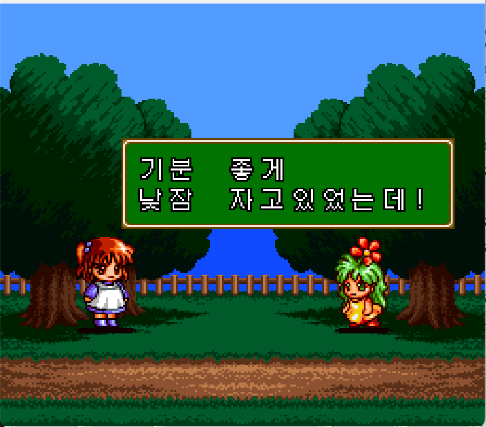

# 마도물어 하나마루 대유치원아 (SNES)

[전체 마도물어 한글 패치 목록으로 돌아가기](../README.md)

슈퍼 패미컴 **마도물어 하나마루 대유치원아** 한글 번역 패치입니다.

참고: [마도물어 하나마루 대유치원아](https://namu.wiki/w/%EB%A7%88%EB%8F%84%EB%AC%BC%EC%96%B4%20%ED%95%98%EB%82%98%EB%A7%88%EB%A3%A8%20%EB%8C%80%EC%9C%A0%EC%B9%98%EC%9B%90%EC%95%84)

## 적용 방법

1. **일본판 원본 ROM**을 준비합니다 (아래 체크섬으로 올바른 파일인지 확인)
2. [Madou Monogatari - Hanamaru Daiyouchienji (KR v1.4.0).bps](<https://raw.githubusercontent.com/mcpads/madou-monogatari-kr-patch/main/sfc-hanamaru/Madou%20Monogatari%20-%20Hanamaru%20Daiyouchienji%20(KR%20v1.4.0).bps>)를 다운로드합니다
3. [Floating IPS (Flips)](https://www.smwcentral.net/?p=section&a=details&id=11474) 등 BPS 패처로 원본 ROM에 한글 패치를 적용합니다

## 체크섬

### 원본 ROM — Madou Monogatari - Hanamaru Daiyouchienji (Japan).sfc

| 알고리즘 | 해시                                                             |
| -------- | ---------------------------------------------------------------- |
| CRC32    | 1354E81E                                                         |
| MD5      | 11b40949b167ee0ed6d7abb9ea32a81f                                 |
| SHA-1    | 164d51ce6cf2228a399ba11fc1f5803cace53cb7                         |
| SHA-256  | 72e7ff7857f577809b585f67f9c6b2211e6648c4f86519fc6c66e3f4bfd49f59 |
| 크기     | 2,097,152 bytes (2 MB)                                           |

### KR 패치 파일 — Madou Monogatari - Hanamaru Daiyouchienji (KR v1.4.0).bps

| 알고리즘 | 해시                                                             |
| -------- | ---------------------------------------------------------------- |
| CRC32    | 2144DF1C                                                         |
| MD5      | 0dbdcbd7b54d74a0f39cc6080bf196a5                                 |
| SHA-1    | aeea4c1c17a5e38215640af66a847e7fca30c5ce                         |
| SHA-256  | 6fe2702d8d8b360aa68b3de1b1e9aec715142325188570f87669c113068350f0 |
| 크기     | 209,229 bytes (204 KB)                                           |

### KR 패치 적용 후 — Madou Monogatari - Hanamaru Daiyouchienji (KR v1.4.0).sfc

| 알고리즘 | 해시                                                             |
| -------- | ---------------------------------------------------------------- |
| CRC32    | AF9747BD                                                         |
| MD5      | 2221584305d8bc960d6c4b79ac45be00                                 |
| SHA-1    | e736c5b43de02d580e091c43a16e95ee7127cc35                         |
| SHA-256  | 8364d39738e293274c4fa5ebeecf987e8337c65539ac18a342220e0b2879d192 |
| 크기     | 2,097,152 bytes (2 MB)                                           |

## 패치 정보

- 한글 폰트: [Galmuri](https://github.com/quiple/galmuri) 12px 및 [Dalmoori](https://github.com/RanolP/dalmoori-font) 8px 비트맵
- [패쳐 코드베이스](https://github.com/mcpads/sfc-madou-kr-patcher)

## 크레딧

- **패치 제작자**: mcpads
- **리버싱**: mcpads (with Claude Code)
- **한글 번역**: Claude Code (Opus 4.6 및 Haiku 4.5), Codex (GPT 5.3 codex)
- **QA**: mcpads
- **원작**: Compile (1996)
