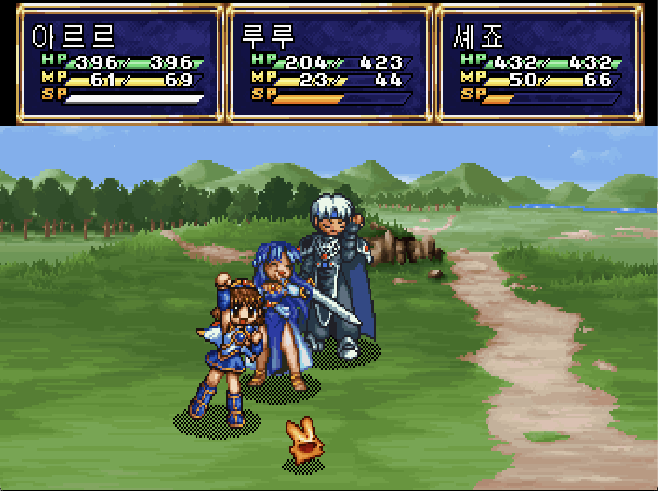

# 마도물어 (세가 새턴)

[전체 마도물어 한글 패치 목록으로 돌아가기](../README.md)

마도물어 **세가 새턴판** 한글 번역 패치입니다.

참고: [마도물어(세가 새턴) - 나무위키](https://namu.wiki/w/%EB%A7%88%EB%8F%84%EB%AC%BC%EC%96%B4(%EC%84%B8%EA%B0%80%20%EC%83%88%ED%84%B4))

## 적용 방법 (J)

1. **원본 ROM**을 준비합니다 (BIN/CUE 형식, 아래 체크섬으로 올바른 파일인지 확인)
2. [Madou Monogatari (Sega Saturn) KR v1.2.0.bps](<https://raw.githubusercontent.com/mcpads/madou-monogatari-kr-patch/main/ss-madou/Madou%20Monogatari%20(Sega%20Saturn)%20KR%20v1.2.0.bps>)를 다운로드합니다
3. [Floating IPS (Flips)](https://www.smwcentral.net/?p=section&a=details&id=11474) 등 BPS 패처로 원본 BIN 파일에 한글 패치를 적용합니다

## 적용 방법 (U)

1. **원본 ROM**을 준비합니다 (BIN/CUE 형식, 아래 체크섬으로 올바른 파일인지 확인)
2. [Madou Monogatari (U) (Sega Saturn) KR v1.2.0.bps](<https://raw.githubusercontent.com/mcpads/madou-monogatari-kr-patch/main/ss-madou/Madou%20Monogatari%20(U)%20(Sega%20Saturn)%20KR%20v1.2.0.bps>)를 다운로드합니다
3. [Floating IPS (Flips)](https://www.smwcentral.net/?p=section&a=details&id=11474) 등 BPS 패처로 원본 BIN 파일에 한글 패치를 적용합니다

## 체크섬 (J)

### 원본 ROM — Madou Monogatari (J).bin (T-6607G V1.003)

| 알고리즘 | 해시                                         |
| -------- | -------------------------------------------- |
| CRC32    | `BBC3E5FA`                                   |
| MD5      | `fbc3ec7db5ca799ad30c5c772ff2b682`           |
| SHA-1    | `a3a4a727c91aa7c2eec8795457459bf6f1297721`   |
| 크기     | 146,661,312 bytes (140 MB, BIN/CUE Track 01) |

### KR 패치 파일 — Madou Monogatari (Sega Saturn) KR v1.2.0.bps

| 알고리즘 | 해시                                                               |
| -------- | ------------------------------------------------------------------ |
| CRC32    | `2144DF1C`                                                         |
| MD5      | `3335ea848ab4eac98f5a49cdf748bd46`                                 |
| SHA-1    | `615d4e6f4b3f125c05cf1852544b630cd311749d`                         |
| SHA-256  | `51c746166f33a4353ade60e6149800cedb76f59948f7583bb05fb4ccb4c9b0b1` |
| 크기     | 4,495,930 bytes (4.3 MB)                                           |

### KR 패치 적용 후 — Madou Monogatari (Sega Saturn) KR v1.2.0.bin

| 알고리즘 | 해시                                                               |
| -------- | ------------------------------------------------------------------ |
| CRC32    | `EAE5DB4F`                                                         |
| MD5      | `9342d4379a82e45346d69e311bd6878d`                                 |
| SHA-1    | `554e89c49a62ea993ddcbe6ea3e9b970fbaeaaa5`                         |
| SHA-256  | `2de4df18fdabfff2de50adbea739cc584d7f5e4b7a9a4f9179fd42f50ef22cad` |
| 크기     | 146,661,312 bytes (140 MB)                                         |

## 체크섬 (U)

### 원본 ROM — Madou Monogatari (U).bin (T-6607G V1.003)

| 알고리즘 | 해시                                         |
| -------- | -------------------------------------------- |
| CRC32    | `C616ED2D`                                   |
| MD5      | `de1e8fb1b4d0901efd2aee5b09d0fcf9`           |
| SHA-1    | `e60b8ff5d9acc3366a36b1101013f529f722942d`   |
| 크기     | 146,308,512 bytes (139 MB, BIN/CUE Track 01) |

### KR 패치 파일 — Madou Monogatari (U) (Sega Saturn) KR v1.2.0.bps

| 알고리즘 | 해시                                                               |
| -------- | ------------------------------------------------------------------ |
| CRC32    | `2144DF1C`                                                         |
| MD5      | `b1672f3d7651335f5e099823a143362d`                                 |
| SHA-1    | `26b9ee99d2672a1d25623cb430a853760626fad2`                         |
| SHA-256  | `6cee8d3d6081418f7a1f15de4ea6f5286f61a21372dad601ba85a3925be1daa9` |
| 크기     | 4,496,082 bytes (4.3 MB)                                           |

### KR 패치 적용 후 — Madou Monogatari (U) (Sega Saturn) KR v1.2.0.bin

| 알고리즘 | 해시                                                               |
| -------- | ------------------------------------------------------------------ |
| CRC32    | `0D089EE2`                                                         |
| MD5      | `192211c8231eb23ec859da0c4ae90119`                                 |
| SHA-1    | `a891c420f021ae8e6160215480e58e9eaecc1087`                         |
| SHA-256  | `0554b416cba5c2af087f63c9901709e147aeb6a8ad62d3322306d0c69d181510` |
| 크기     | 146,308,512 bytes (139 MB)                                         |

## 패치 정보

- 시나리오/이벤트 대사 번역, 시스템 UI 및 타이틀 한글화
- 한글 폰트: [Galmuri](https://github.com/quiple/galmuri) (대화, 메뉴 탭), [MaplestoryBold](https://maplestory.nexon.com/Media/Font) (프롤로그, 레벨업), [Dalmoori](https://github.com/RanolP/dalmoori-font) (전투 UI)
- [패쳐 코드베이스](https://github.com/mcpads/ss-madou-kr-patcher)

## 크레딧

- **패치 제작자**: mcpads
- **리버싱**: mcpads (with Claude Code)
- **한글 번역**: Claude Code (Opus 4.6 및 Haiku 4.5), Codex (GPT 5.3 codex)
- **QA**: mcpads
- **원작**: Compile (1998)
