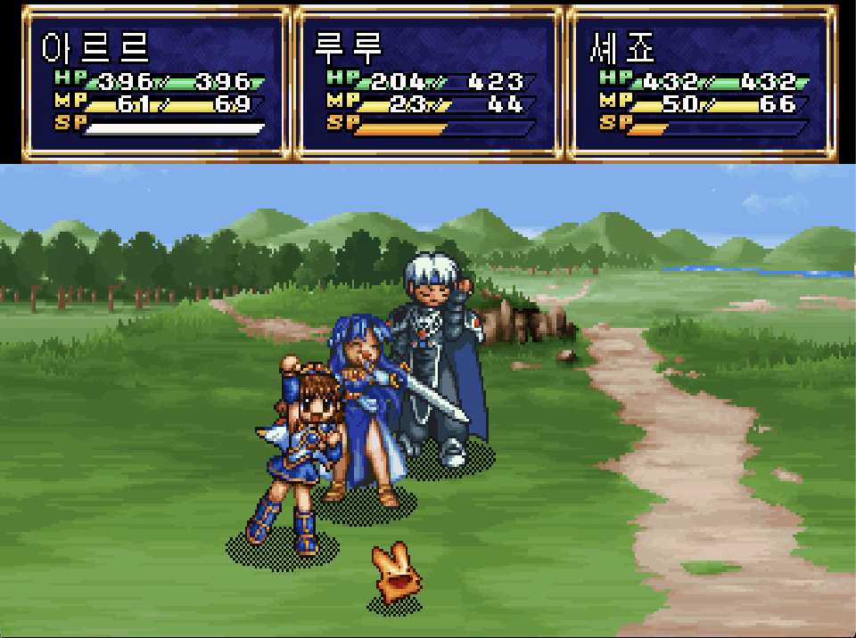

# 마도물어 — 세가 새턴

[전체 마도물어 한글 패치 목록으로 돌아가기](../README.md)

마도물어 **세가 새턴판** 한글 번역 패치입니다.

> **정식 배포 (v2.0.0)**


참고: [마도물어(세가 새턴) - 나무위키](https://namu.wiki/w/%EB%A7%88%EB%8F%84%EB%AC%BC%EC%96%B4(%EC%84%B8%EA%B0%80%20%EC%83%88%ED%84%B4))




## v2.0.0 적용 방법

1. 아래 체크섬에 맞는 JP 또는 US 원본 BIN 파일을 준비합니다. 기존 한글판에는 적용하지 마세요.
2. 원본에 맞는 패치를 다운로드합니다.
   - [JP용 xdelta](https://raw.githubusercontent.com/mcpads/madou-monogatari-kr-patch/main/ss-madou/Madou%20Monogatari%20%28JP%29%20%28Sega%20Saturn%29%20KR%20v2.0.0.xdelta)
   - [US용 xdelta](https://raw.githubusercontent.com/mcpads/madou-monogatari-kr-patch/main/ss-madou/Madou%20Monogatari%20%28US%29%20%28Sega%20Saturn%29%20KR%20v2.0.0.xdelta)
3. `xdelta3` 등 xdelta 호환 패처로 원본 BIN에 적용합니다.
4. **각 원본의 CUE 파일과 오디오 트랙 설정을 유지**하고, CUE의 `FILE` 항목만 패치 결과 BIN의 파일명으로 맞춥니다. JP와 US의 CUE를 서로 바꾸지 마세요.

```sh
xdelta3 -d -s "original.bin" "Madou Monogatari (JP) (Sega Saturn) KR v2.0.0.xdelta" "Madou_Monogatari_KO.bin"
```

US 원본은 위 명령의 패치 파일명을 US용으로 바꿔 적용합니다.

### 원본 BIN 체크섬

| 원본 | 크기 | SHA-256 |
| --- | --- | --- |
| JP | 146,661,312 bytes | `c2f174280295ea3e992cfd8bfc04b474caf4ee017c3c4aa8896b85e3ff96e904` |
| US | 146,308,512 bytes | `64de3234eef76b18cc68faca68c2591e220c258342b99aabe21df55f760fa2cd` |

### v2.0.0 패치 체크섬

| 패치 | 크기 | SHA-256 |
| --- | --- | --- |
| JP용 xdelta | 2,710,636 bytes | `cdc04cfa8f89a4b642c1285a16c4c33322b83da4a66c2ec96ee04c9e906ba1b6` |
| US용 xdelta | 2,710,906 bytes | `262d3f3264a633e767f0c30e220db891e544bfebc39845e32f33efcfb391a79d` |

## 패치 정보

- 시나리오/이벤트 대사 번역, 시스템 UI 및 타이틀 한글화
- 한글 폰트: [Galmuri](https://github.com/quiple/galmuri) (대화, 메뉴 탭), [MaplestoryBold](https://maplestory.nexon.com/Media/Font) (프롤로그, 레벨업), [Dalmoori](https://github.com/RanolP/dalmoori-font) (전투 UI)
- [패쳐 코드베이스](https://github.com/mcpads/ss-madou-kr-patcher)

## 크레딧

- **패치 제작자**: mcpads
- **리버싱**: mcpads (with Claude Code)
- **한글 번역**: Claude Code (Opus 4.6 및 Haiku 4.5), Codex (GPT 5.3 codex)
- **QA**: mcpads
- **원작**: Compile (1998)
