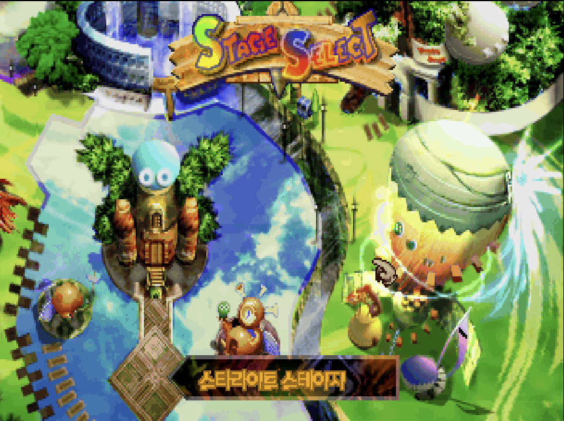
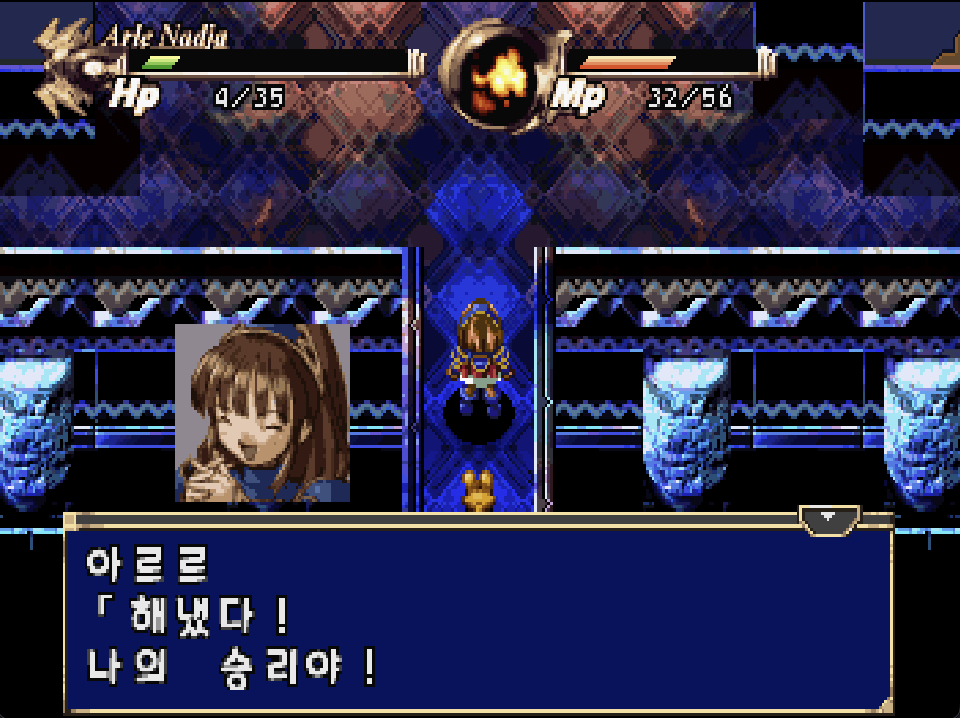

# 와쿠와쿠 뿌요뿌요 던전 — 세가 새턴

[전체 마도물어 한글 패치 목록으로 돌아가기](../README.md)

**와쿠와쿠 뿌요뿌요 던전 (わくわくぷよぷよダンジョン) 세가 새턴 판** 한글 번역 PoC 패치입니다.

> ⚠️ **베타 배포 (v0.3.0)**: 번역·표기·그래픽과 패치 내용은 추후 변경될 수 있으며, 게임 진행 중 오류가 발생할 수 있습니다.

참고: [와쿠와쿠 뿌요뿌요 던전 - 나무위키](https://namu.wiki/w/%EC%99%80%EC%BF%A0%EC%99%80%EC%BF%A0%20%EB%BF%8C%EC%9A%94%EB%BF%8C%EC%9A%94%20%EB%8D%98%EC%A0%84)

## 적용 방법

1. **원본 ROM**을 준비합니다 (BIN/CUE 형식, 아래 체크섬으로 올바른 파일인지 확인)
2. [Waku Waku Puyo Puyo Dungeon (Sega Saturn) KR v0.3.0.bps](<https://raw.githubusercontent.com/mcpads/madou-monogatari-kr-patch/main/ss-waku-puyo/Waku%20Waku%20Puyo%20Puyo%20Dungeon%20(Sega%20Saturn)%20KR%20v0.3.0.bps>)를 다운로드합니다
3. [Floating IPS (Flips)](https://www.smwcentral.net/?p=section&a=details&id=11474) 등 BPS 패처로 원본 BIN 파일(Track 1)에 한글 패치를 적용합니다

## 체크섬

### 원본 ROM — Waku Waku Puyo Puyo Dungeon (Japan) (4M) (Track 1).bin (T-6608G V1.001)

| 알고리즘 | 해시                                                               |
| -------- | ------------------------------------------------------------------ |
| CRC32    | `B8D1E870`                                                         |
| MD5      | `567e6dfc4776c7cf3e417d5c98f34dbf`                                 |
| SHA-1    | `e0af339ab1985b33560937fa69f01a1d19c61242`                         |
| SHA-256  | `3edd5058cce6c6d36b69813a8d207d15fece8b79f3b5638522325fe3fa839f69` |
| 크기     | 89,848,752 bytes (85 MB, BIN/CUE Track 01)                         |

### KR 패치 파일 — Waku Waku Puyo Puyo Dungeon (Sega Saturn) KR v0.3.0.bps

| 알고리즘 | 해시                                                               |
| -------- | ------------------------------------------------------------------ |
| CRC32    | `2144DF1C`                                                         |
| MD5      | `0488314bfb8a4ff55da6e3f93d58f077`                                 |
| SHA-1    | `81477cd5ce28c316a3b35cb94cd48316ee21c151`                         |
| SHA-256  | `44e47cdd2a989f30b270ea32997f194e65299d214a1c6021d30e8b2fd7de1b59` |
| 크기     | 1,359,827 bytes (1.3 MB)                                           |

### KR 패치 적용 후 — Waku Waku Puyo Puyo Dungeon (Sega Saturn) KR v0.3.0.bin

| 알고리즘 | 해시                                                               |
| -------- | ------------------------------------------------------------------ |
| CRC32    | `B8237848`                                                         |
| MD5      | `2318fa35614922ccb266fe0140715645`                                 |
| SHA-1    | `d8f8a8817633c34f3a540374c0cc62d6a2d215ef`                         |
| SHA-256  | `00c60e136f0b3de4a6b51783579a4fdb6070431a104ae4fd7529bfdffb4fc014` |
| 크기     | 89,848,752 bytes (85 MB)                                           |

## 패치 정보

- 시나리오/이벤트 대사 초벌 번역, 시스템 UI 한글화
- 한글 폰트: [MaplestoryLight](https://maplestory.nexon.com/Media/Font), [MaplestoryBold](https://maplestory.nexon.com/Media/Font), [Galmuri](https://github.com/quiple/galmuri), [Dalmoori](https://github.com/RanolP/dalmoori-font)
- [패쳐 코드베이스](https://github.com/mcpads/ss-waku-puyo-kr-patcher)

## 크레딧

- **패치 제작자**: mcpads
- **리버싱**: mcpads (with Claude Code)
- **한글 번역**: Claude Code (Opus 4.6 및 Sonnet 4.6), Codex (GPT 5.4)
- **QA**: mcpads
- **원작**: Compile (1998)
