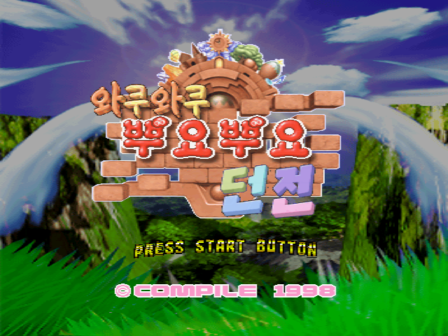
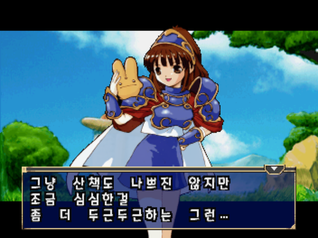
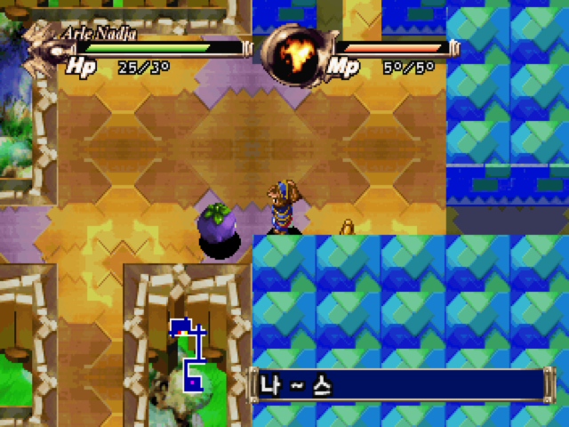

# 와쿠와쿠 뿌요뿌요 던전 — 세가 새턴

[전체 마도물어 한글 패치 목록으로 돌아가기](../README.md)

**와쿠와쿠 뿌요뿌요 던전 (わくわくぷよぷよダンジョン) 세가 새턴 판** 한글 번역 패치입니다.

> **정식 배포 (v1.0.1)**

참고: [와쿠와쿠 뿌요뿌요 던전 - 나무위키](https://namu.wiki/w/%EC%99%80%EC%BF%A0%EC%99%80%EC%BF%A0%20%EB%BF%8C%EC%9A%94%EB%BF%8C%EC%9A%94%20%EB%8D%98%EC%A0%84)

## 적용 방법

1. **원본 ROM**을 준비합니다 (BIN/CUE 형식, 아래 체크섬으로 올바른 파일인지 확인)
2. [Waku Waku Puyo Puyo Dungeon (Sega Saturn) KR v1.0.1.xdelta](<https://raw.githubusercontent.com/mcpads/madou-monogatari-kr-patch/main/ss-waku-puyo/Waku%20Waku%20Puyo%20Puyo%20Dungeon%20(Sega%20Saturn)%20KR%20v1.0.1.xdelta>)를 다운로드합니다
3. Delta Patcher 등 xdelta 패처로 원본 BIN 파일(Track 1)에 한글 패치를 적용합니다.

## 체크섬

| 구분 | SHA-256 |
| --- | --- |
| 원본 Track 1 (T-6608G V1.001) | `3edd5058cce6c6d36b69813a8d207d15fece8b79f3b5638522325fe3fa839f69` |
| 패치 | `0bbfee2e6fa050f69b390708a4dc8be04b4f6c24b7efc5efbf9bc711d1e58b54` |

## 패치 정보

- 시나리오·이벤트 대사, 시스템 UI와 타이틀 한글화
- 한글 폰트: [MaplestoryLight](https://maplestory.nexon.com/Media/Font), [MaplestoryBold](https://maplestory.nexon.com/Media/Font), [Galmuri](https://github.com/quiple/galmuri), [Dalmoori](https://github.com/RanolP/dalmoori-font)
- [패쳐 코드베이스](https://github.com/mcpads/ss-waku-puyo-kr-patcher)

## 크레딧

- **패치 제작자**: mcpads
- **리버싱**: mcpads (with Claude Code)
- **한글 번역**: Claude Code (Opus 4.6 및 Sonnet 4.6), Codex (GPT 5.4)
- **QA**: mcpads
- **원작**: Compile (1998)
